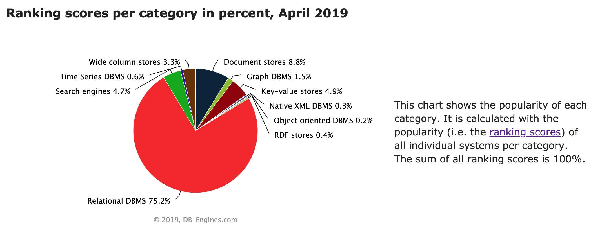
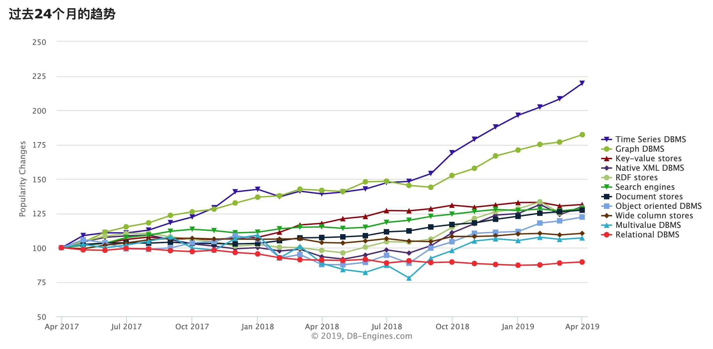
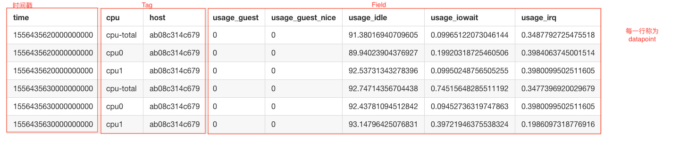

# Time Series DBMS's Technology and Framework Evolution

> 时序数据库技术和架构演进

## 时序数据与时序数据库

### 什么是时序数据库？

按照维基百科解释，时间序列数据库（TSDB）是一个为了用于处理时间序列数据而优化的软件系统，其按时间数值或时间范围进行索引。

```bash
A Time Series DBMS（TSDB）is a software system that is optimized for handing time series data,
arrays of numbers indexed by time(a datetime or datatime range).
                                                                                ----Wikipedia
```

### 时序数据库增长趋势

时序数据库从2014年开始就被DB-Engine列入了单独的数据库类别进行统计。

下图所示的是每个类别的受欢迎程度。它是根据每个类别的所有单个系统的流行度（即排名分数）计算的。所有排名分数的总和为100％。



下图所示的是在过去的24个月内所有数据库类别在DB-Engine上的增长趋势，可以看出时序数据库的增长趋势排在第一位。



### 时序数据举例

列举一个时序数据的例子，比如A公司在上海不同机房有一些服务器，这些服务器都具有能够代表自身唯一性的标签(Tag)，比如服务器所属机房编号、CPU、内存、磁盘空间等，而每个服务器都会产生一些指标(Metrics)，比如当前的CPU使用率、内存使用情况等。随着时间，这些服务器会产生新的数据，这些数据就是时序数据。

一般会将一个指标，建一个“表”，Metrics/Measurement。例如CPU使用率如下：


|time|cpu |host|usage_guest| usage_guest_nice| usage_idle|usage_iowait |usage_irq |                
|--- |--- |----|    -------|---------------- |---------- |   ----------|     -----|                  
|1556435620000000000 |cpu-total |ab08c314c679 |0|0|91.38016940709605|0.09965122073046144|0.3487792725475518 |        
|1556435620000000000 |cpu0      |ab08c314c679 |0|0|89.94023904376927|0.19920318725460506|0.3984063745001514 |       
|1556435620000000000 |cpu1      |ab08c314c679 |0|0|92.53731343278396|0.09950248756505255|0.3980099502511605 |          
|1556435630000000000 |cpu-total |ab08c314c679 |0|0|92.74714356704438|0.74515648285511192|0.3477396920029679 |           
|1556435630000000000 |cpu0      |ab08c314c679 |0|0|92.43781094512842|0.09452736319747863|0.3980099502511605 |         
|1556435630000000000 |cpu1      |ab08c314c679 |0|0|93.14796425076831|0.39721946375538324|0.1986097318776916 |



### 时序数据库的应用场景

> DevOps监控，应用程序指标，物联网传感器数据和实时分析。

下面是一些时序数据库的应用场景:
* 证券交易场景，大家所熟知的K线图就是一个比较标准的时间序列；
* 又比如像广告数据展示，网站PV/UV，这些对运营人员很重要的时序数据；
* 智能手环、智能手表等可穿戴设备可以采集个人健康数据，比如睡眠信息、运动信息等，并按照时间顺序将其发送到云端，经过一系列计算，最终为用户提供一些建议和提示；
* 除上述比较常见的时序数据之外，还有气温变化情况、工业传感器数据、服务器监控数据、网络设备监控数据等；
* 最后，还有车联网数据场景，如今新能源汽车越来越多，大部分汽车都支持通过APP直接管理，它们会时时刻刻地产生车辆的GPS、续航、安全事件等数据，云端可以利用这些数据进行分析处理，用户也可以用来查看车辆情况。

### 时序数据库的特性

时序特性：对于时序数据的时序特性而言，每条数据都会有一个时间戳，而按照要求的不同，时间戳在精度上有不同。通常而言，大多数时序数据以秒为单位，而在一些工业上会有以毫秒或者纳秒为单位的情况。数据的采样频率主要分为两种，一种是以可感知的周期频率来采集的，另外一种则是以不可感知的网站PV/UV进行离散型采样，这是因为虽然用户访问可以被提前预测，但是精确度不会很高。

数据特性：对于时序数据的数据特性而言，数据都是顺序可追加的，也是多维可关联的，它们具有不同的指标。近期的时序数据往往是大家所关注的，访问频率会比较高，而时间较远的数据所带来的价值则会随着时间的推移而逐渐降低，因此时序数据也存在冷热归档的特性。此外，时序数据也会包含一些具体的数值、状态和事件。

CRUD特性：而对于时序数据库而言，也会有一些CRUD的特性[增加(Create)、读取查询(Read)、更新(Update)和删除(Delete)几个单词的首字母简写]。时序数据库的读写有点类似LSM数据库的特点，写操作的频率远远大于读，并且存在一定的时间窗口。此外，时序数据库通常极少更新数据，存在一定的覆盖写，并且支持批量删除操作。而随着业务对于技术的要求越来越高，因此时序数据库也需要支持高可用、高可靠以及可伸缩等特性。通常情况下，时序数据库不具备事务能力。

## 时序数据库的演变

如上图所示的是随着时间而诞生的一些比较具有代表性的时序数据库。最早诞生的时序数据库就是RRDTool，RRD是Round-Robin Database的意思，它属于基于平板文件的简单存储。后来，伴随着大数据和Hadoop生态的发展，OpenTSDB，KairosDB这些基于Hadoop之上通用存储而专门构建的时间序列数据库开始出现，它可以按时间间隔高效地存储和处理数据。 而由于OpenTSDB基于HBase这样一个通用的NoSQL存储，虽然可以解决时序相关的一些场景问题，但无法满足对于成本和性能要求更高的场景。而随着Docker、Kubernetes、微服务等技术的发展，以及对于IoT的发展预期越来越强烈。在数据随着时间而增长的过程中，时间序列数据成为增长最快的数据类型之一。高性能、低成本的垂直型时序数据库开始诞生，以InfluxDB为代表的具有时序特征的数据存储引擎逐步引领市场。而在后来的2015年，FaceBook开源了Gorilla，在时序领域应用比较广泛。在2017年，微软发布了Azure Series Insights。2018年，Amazon发布了Timestream预览版。由此可以看出，时序数据库的需求与应用愈发广泛。

## 时序数据库对比

## 实践总结

### 1. 访问D_ENGINE网站了解最新的时序数据库排名情况

[time+series+dbms ranking](https://db-engines.com/en/ranking/time+series+dbms)

### 2. 访问GitHub了解排名第一的InfluxDB

[influxdata](https://github.com/influxdata)
[influxdb](https://github.com/influxdata/influxdb)
[Telegraf playground](https://rootnroll.com/d/telegraf/)

```bash
Linux ab08c314c679 4.14.81-coreos x86_64                                   
 07:12:58 up 9 days, 18:23,  0 users,  load average: 0.36, 0.47, 0.49      
 ~  sudo service telegraf start            Sun 28 Apr 2019 07:13:06 AM UTC
Starting the process telegraf [ OK ]                                       
telegraf process was started [ OK ]                                        
 ~  influx -database telegraf              Sun 28 Apr 2019 07:13:26 AM UTC
Connected to http://localhost:8086 version 1.7.5                           
InfluxDB shell version: 1.7.5                                              
Enter an InfluxQL query                                                    
> show database;                                                           
ERR: error parsing query: found DATABASE, expected CONTINUOUS, DATABASES, D
IAGNOSTICS, FIELD, GRANTS, MEASUREMENT, MEASUREMENTS, QUERIES, RETENTION, S
ERIES, SHARD, SHARDS, STATS, SUBSCRIPTIONS, TAG, USERS at line 1, char 6   
> show databases;                                                          
name: databases                                                            
name                                                                       
----                                                                       
_internal                                                                  
telegraf                                                                   
> use telegraf                                                             
Using database telegraf
> show measurements;                                                       
name: measurements                                                         
name                                                                       
----                                                                       
disk                                                                       
diskio                                                                     
kernel                                                                     
mem                                                                        
processes                                                                  
swap                                                                       
system                                                                     
> show field keys from cpu;                                                
name: cpu                                                                  
fieldKey         fieldType                                                 
--------         ---------                                                 
usage_guest      float                                                     
usage_guest_nice float                                                     
usage_idle       float                                                     
usage_iowait     float                                                     
usage_irq        float                                                     
usage_nice       float                                                     
usage_softirq    float                                                     
usage_steal      float                                                     
usage_system     float                                                     
usage_user       float                                                     
> show tag keys from cpu;                                                  
name: cpu                                                                  
tagKey                                                                     
------                                                                     
cpu                                                                        
host                                                                       
> show series from cpu;                                                    
key                                                                        
---                                                                        
cpu,cpu=cpu-total,host=ab08c314c679                                        
cpu,cpu=cpu0,host=ab08c314c679                                             
cpu,cpu=cpu1,host=ab08c314c679

> select usage_idle,usage_iowait from cpu where cpu='cpu0' and host='ab08c3
14c679' limit 5                                                            
name: cpu                                                                  
time                usage_idle        usage_iowait                         
----                ----------        ------------                         
1556435620000000000 89.94023904376927 0.19920318725460506                  
1556435630000000000 92.4378109451284  1.0945273631974786                   
1556435640000000000 90.88176352681684 0.30060120239019933                  
1556435650000000000 93.6299292213977  0.707785642058747                    
1556435660000000000 95.67839195931452 0.3015075376929069                                          
```
