<!-- TOC depthFrom:1 depthTo:6 withLinks:1 updateOnSave:1 orderedList:0 -->

- [InfluxDB](#influxdb)
	- [InfluxDB初体验](#influxdb初体验)
		- [1. 安装InfluxDB](#1-安装influxdb)
		- [2. 查看软件结构](#2-查看软件结构)
		- [3. 启动服务](#3-启动服务)
		- [4. 配置InfluxDB OSS](#4-配置influxdb-oss)
		- [5. 通过influx客户端命令连接数据库](#5-通过influx客户端命令连接数据库)
	- [InfluxSQL VS SQL](#influxsql-vs-sql)
	- [认证和权限管理](#认证和权限管理)
		- [管理员用户](#管理员用户)
		- [相关命令](#相关命令)
		- [开启认证权限](#开启认证权限)
		- [influx带认证登录](#influx带认证登录)
	- [搭建TICK运维栈](#搭建tick运维栈)
		- [TICK简介](#tick简介)
		- [influxdb 1.7 版本](#influxdb-17-版本)
		- [1. 安装influxdb 2.0最新版本](#1-安装influxdb-20最新版本)
		- [2. 安装telegraf chronograf kapacitor](#2-安装telegraf-chronograf-kapacitor)
		- [3. 查询数据](#3-查询数据)
		- [4. 可视化数据](#4-可视化数据)
		- [5. 处理数据](#5-处理数据)
		- [6. 管理组织](#6-管理组织)
		- [7. 管理用户](#7-管理用户)
		- [8. 安全和授权](#8-安全和授权)

<!-- /TOC -->
# InfluxDB

## InfluxDB初体验

[installation doc](https://docs.influxdata.com/influxdb/v1.7/introduction/installation/)

### 1. 安装InfluxDB

Red Hat和CentOS用户可以使用yum包管理器安装最新稳定版本的InfluxDB

```shell
cat <<EOF | sudo tee /etc/yum.repos.d/influxdb.repo
[influxdb]
name = InfluxDB Repository - RHEL \$releasever
baseurl = https://repos.influxdata.com/rhel/\$releasever/\$basearch/stable
enabled = 1
gpgcheck = 1
gpgkey = https://repos.influxdata.com/influxdb.key
EOF

sudo yum install influxdb -y
```

### 2. 查看软件结构

```shell
[root@sh_01 booboo]# rpm -ql influxdb
/etc/influxdb/influxdb.conf
/etc/logrotate.d/influxdb
/usr/bin/influx
/usr/bin/influx_inspect
/usr/bin/influx_stress
/usr/bin/influx_tsm
/usr/bin/influxd
/usr/lib/influxdb/scripts/influxdb.service
/usr/lib/influxdb/scripts/init.sh
/usr/share/man/man1/influx.1.gz
/usr/share/man/man1/influx_inspect.1.gz
/usr/share/man/man1/influx_stress.1.gz
/usr/share/man/man1/influx_tsm.1.gz
/usr/share/man/man1/influxd-backup.1.gz
/usr/share/man/man1/influxd-config.1.gz
/usr/share/man/man1/influxd-restore.1.gz
/usr/share/man/man1/influxd-run.1.gz
/usr/share/man/man1/influxd-version.1.gz
/usr/share/man/man1/influxd.1.gz
/var/lib/influxdb
/var/log/influxdb

```

|文件|说明|
|:--|:--|
|`/etc/influxdb/influxdb.conf`|配置文件|
|`/usr/bin/`|可执行文件|
|`/var/lib/influxdb/`|数据目录|
|`/var/log/influxdb`|日志目录|
|`influxdb`|服务名|
|`influxd`|守护进程名|
|`8086`|监听端口|

### 3. 启动服务

```shell
[root@sh_01 booboo]# systemctl start influxdb
[root@sh_01 booboo]# systemctl status influxdb
● influxdb.service - InfluxDB is an open-source, distributed, time series database
   Loaded: loaded (/usr/lib/systemd/system/influxdb.service; enabled; vendor preset: disabled)
   Active: active (running) since 六 2019-05-04 15:55:58 CST; 4s ago
     Docs: https://docs.influxdata.com/influxdb/
 Main PID: 3501 (influxd)
   CGroup: /system.slice/influxdb.service
           └─3501 /usr/bin/influxd -config /etc/influxdb/influxdb.conf

5月 04 15:55:59 sh_01 influxd[3501]: ts=2019-05-04T07:55:59.528855Z lvl=in...0m
5月 04 15:55:59 sh_01 influxd[3501]: ts=2019-05-04T07:55:59.528869Z lvl=in...ot
5月 04 15:55:59 sh_01 influxd[3501]: ts=2019-05-04T07:55:59.528881Z lvl=in...er
5月 04 15:55:59 sh_01 influxd[3501]: ts=2019-05-04T07:55:59.528896Z lvl=in...se
5月 04 15:55:59 sh_01 influxd[3501]: ts=2019-05-04T07:55:59.528938Z lvl=in...rr
5月 04 15:55:59 sh_01 influxd[3501]: ts=2019-05-04T07:55:59.529104Z lvl=in...se
5月 04 15:55:59 sh_01 influxd[3501]: ts=2019-05-04T07:55:59.529133Z lvl=in...0m
5月 04 15:55:59 sh_01 influxd[3501]: ts=2019-05-04T07:55:59.529318Z lvl=in...00
5月 04 15:55:59 sh_01 influxd[3501]: ts=2019-05-04T07:55:59.529601Z lvl=in...0s
5月 04 15:55:59 sh_01 influxd[3501]: ts=2019-05-04T07:55:59.529995Z lvl=in...00
Hint: Some lines were ellipsized, use -l to show in full.

[root@sh_01 booboo]# ps -ef|grep influxd
influxdb  3501     1  0 15:55 ?        00:00:00 /usr/bin/influxd -config /etc/influxdb/influxdb.conf
root      3605  3095  0 15:57 pts/0    00:00:00 grep --color=auto influxd
[root@sh_01 booboo]# ss -luntp|grep influxd
tcp    LISTEN     0      128    127.0.0.1:8088                  *:*                   users:(("influxd",pid=3501,fd=3))
tcp    LISTEN     0      128      :::8086                 :::*                   users:(("influxd",pid=3501,fd=5))
```

### 4. 配置InfluxDB OSS

`influxd config`命令查看默认配置设置。

此处修改infludb的数据目录为`/booboo/influxdb`

```shell
[root@sh_01 booboo]# sed -i 's/var\/lib/booboo/g' /etc/influxdb/influxdb.conf
[root@sh_01 booboo]# grep booboo /etc/influxdb/influxdb.conf
  dir = "/booboo/influxdb/meta"
  dir = "/booboo/influxdb/data"
  wal-dir = "/booboo/influxdb/wal"
[root@sh_01 booboo]# mkdir /booboo/influxdb/meta -p
[root@sh_01 booboo]# mkdir /booboo/influxdb/data -p
[root@sh_01 booboo]# mkdir /booboo/influxdb/wal -p
[root@sh_01 booboo]# chown influxdb. /booboo/influxdb/ -R
[root@sh_01 booboo]# systemctl restart influxdb
[root@sh_01 booboo]# systemctl status influxdb
[root@sh_01 booboo]# systemctl status influxdb -l
[root@sh_01 influxdb]# systemctl status influxdb
● influxdb.service - InfluxDB is an open-source, distributed, time series database
   Loaded: loaded (/usr/lib/systemd/system/influxdb.service; enabled; vendor preset: disabled)
   Active: active (running) since 六 2019-05-04 16:12:44 CST; 2s ago
     Docs: https://docs.influxdata.com/influxdb/
 Main PID: 4613 (influxd)
   CGroup: /system.slice/influxdb.service
           └─4613 /usr/bin/influxd -config /etc/influxdb/influxdb.conf

5月 04 16:12:45 sh_01 influxd[4613]: ts=2019-05-04T08:12:45.614416Z lvl=info msg="Starting precreation service" log_id=0FCUHrHG000 serv...riod=30m
5月 04 16:12:45 sh_01 influxd[4613]: ts=2019-05-04T08:12:45.614425Z lvl=info msg="Starting snapshot service" log_id=0FCUHrHG000 service=snapshot
5月 04 16:12:45 sh_01 influxd[4613]: ts=2019-05-04T08:12:45.614432Z lvl=info msg="Starting continuous query service" log_id=0FCUHrHG000..._querier
5月 04 16:12:45 sh_01 influxd[4613]: ts=2019-05-04T08:12:45.614443Z lvl=info msg="Starting HTTP service" log_id=0FCUHrHG000 service=htt...on=false
5月 04 16:12:45 sh_01 influxd[4613]: ts=2019-05-04T08:12:45.614448Z lvl=info msg="opened HTTP access log" log_id=0FCUHrHG000 service=ht...h=stderr
5月 04 16:12:45 sh_01 influxd[4613]: ts=2019-05-04T08:12:45.614535Z lvl=info msg="Listening on HTTP" log_id=0FCUHrHG000 service=httpd a...ps=false
5月 04 16:12:45 sh_01 influxd[4613]: ts=2019-05-04T08:12:45.614552Z lvl=info msg="Starting retention policy enforcement service" log_id...rval=30m
5月 04 16:12:45 sh_01 influxd[4613]: ts=2019-05-04T08:12:45.614605Z lvl=info msg="Listening for signals" log_id=0FCUHrHG000
5月 04 16:12:45 sh_01 influxd[4613]: ts=2019-05-04T08:12:45.615116Z lvl=info msg="Storing statistics" log_id=0FCUHrHG000 service=monito...rval=10s
5月 04 16:12:45 sh_01 influxd[4613]: ts=2019-05-04T08:12:45.615434Z lvl=info msg="Sending usage statistics to usage.influxdata.com" log...UHrHG000
Hint: Some lines were ellipsized, use -l to show in full.
```

* mata 元数据
* data 数据
* wal 预写日志

### 5. 通过influx客户端命令连接数据库

* [influxQL doc](https://docs.influxdata.com/influxdb/v1.7/introduction/getting-started/)
* [语法](https://docs.influxdata.com/influxdb/v1.7/write_protocols/line_protocol_reference/#syntax)


```SQL
[root@sh_01 influxdb]# influx -precision rfc3339
Connected to http://localhost:8086 version 1.7.6
InfluxDB shell version: 1.7.6
Enter an InfluxQL query
> create database booboo
> show databases;
name: databases
name
----
_internal
booboo
> use booboo
Using database booboo
> INSERT cpu,host=serverA,region=us_west value=0.64
> show measurements
name: measurements
name
----
cpu
> select host,region from cpu
> select host,region,value from cpu
name: cpu
time                           host    region  value
----                           ----    ------  -----
2019-05-04T08:17:15.537746905Z serverA us_west 0.64
```

InfluxDB HTTP API 8086默认在端口上运行。因此，influx将连接到端口8086和localhost默认。如果您需要更改这些默认值，请运行influx --help。

该`-precision`参数指定任何返回的时间戳的格式/精度。在上面的示例中，`rfc3339`告诉InfluxDB以`RFC3339`格式（`YYYY-MM-DDTHH:MM:SS.nnnnnnnnnZ`）返回时间戳。

不带该参数则默认直接返回时间戳：

```SQL
> select * from cpu
name: cpu
time                host    region  value
----                ----    ------  -----
1556957835537746905 serverA us_west 0.64
```

## InfluxSQL VS SQL

[InfluxSQL VS SQL](https://docs.influxdata.com/influxdb/v1.7/concepts/crosswalk/)

|No.|SQL|influxQL|
|:--|:--|:--|
|命令提交符|默认`;`|回车|
|关键字大小写|不区分|不区分|
|表名|默认区分|区分|
|建库|`create database booboo;`|`create database booboo`|
|查看库|`show databases;`|`show databases`|
|使用某个库|`use booboo;`|`use booboo`|
|查看表/指标|`show tables;`|`show measurements`|
|建表|`create table t1 (id int primary key,create_time datetime,host varchar(255),region varchar(255),cpu_idle float);`|无|
|插入|`insert into t1 values (1,now(),'serverA','us_west',77.56);`|`INSERT t1,host=serverA,region=us_west value=0.64`|
|删除|`delete from t1 where id=1;`|`DELETE FROM t1 WHERE host="serverA"`|
|更新|`update t1 set cpu_idle=98.77 where id=1;`|无|
|删表|`drop table t1;`|`DROP MEASUREMENT t1`|
|删库|`drop database booboo;`|`drop database booboo`|

## 认证和权限管理


### 管理员用户

[管理员用户](https://docs.influxdata.com/influxdb/v1.7/administration/authentication_and_authorization/#admin-users)

管理员用户拥有`READ`并`WRITE`访问所有数据库并可以完全访问以下管理查询：

数据库管理：
   ◦    `CREATE DATABASE`，并`DROP DATABASE`
   ◦    `DROP SERIES`和`DROP MEASUREMENT`
   ◦    `CREATE RETENTION POLICY`，`ALTER RETENTION POLICY`以及`DROP RETENTION POLICY`
   ◦    `CREATE CONTINUOUS QUERY`和`DROP CONTINUOUS QUERY`

用户管理：
   - [`CREATE USER`](https://docs.influxdata.com/influxdb/v1.7/administration/authentication_and_authorization/#user-management-commands)
   - [`GRANT ALL PRIVILEGES`](https://docs.influxdata.com/influxdb/v1.7/administration/authentication_and_authorization/#grant-administrative-privileges-to-an-existing-user)
   - [`REVOKE ALL PRIVILEGES`](https://docs.influxdata.com/influxdb/v1.7/administration/authentication_and_authorization/#revoke-administrative-privileges-from-an-admin-user)
   - [`SHOW GRANTS`](https://docs.influxdata.com/influxdb/v1.7/administration/authentication_and_authorization/#show-a-user-s-database-privileges)
   - [`SET PASSWORD`](https://docs.influxdata.com/influxdb/v1.7/administration/authentication_and_authorization/#re-set-a-user-s-password)
   - [`DROP USER`](https://docs.influxdata.com/influxdb/v1.7/administration/authentication_and_authorization/#drop-a-user)                  

### 相关命令

|认证和权限管理|命令|
|:--|:--|
|创建用户|`CREATE USER <username> WITH PASSWORD '<password>' WITH ALL PRIVILEGES`|
||`CREATE USER <username> WITH PASSWORD '<password>'`|
|添加权限|`GRANT ALL PRIVILEGES TO <username>`|
||`GRANT [READ,WRITE,ALL] ON <database_name> TO <username>`|
|回收权限|`REVOKE ALL PRIVILEGES FROM <username>`|
||`REVOKE [READ,WRITE,ALL] ON <database_name> FROM <username>`|
|删除用户|`DROP USER <username>`|
|查看用户|`SHOW USERS`|
|查看权限|`SHOW GRANTS FOR <user_name>`|
|重设密码|`SET PASSWORD FOR <username> = '<password>'`|

**笔记：**

- 如果用户值以数字开头，则必须用双引号括起来 ;

- 密码[字符串](https://docs.influxdata.com/influxdb/v1.7/query_language/spec/#strings)必须用单引号括起来。


### 开启认证权限

默认情况下，配置文件中禁用身份验证，此时先创建一个管理员用户；

```sql
CREATE USER admin WITH PASSWORD 'Admin123' WITH ALL PRIVILEGES
```

通过在配置文件的部分中设置`auth-enabled`选项来启用身份验证：`true [http]`

```shell
[http]
  enabled = true
  bind-address = ":8086"
  auth-enabled = true # ✨
  log-enabled = true
  write-tracing = false
  pprof-enabled = false
  https-enabled = true
  https-certificate = "/etc/ssl/influxdb.pem"
```

重启influxdb `systemctl restart influxdb`

### influx带认证登录

通过在启动CLI时设置`username`和`password`标记进行身份验证

```shell
influx -username <username> -password '<password>'
```

启动CLI后进行身份验证`auth <username> <password>`

```shell
influx
> auth
username: admin
password:
```

练习：

```
[root@db ~]# influx -username admin -password 'Aadmin123'
Connected to http://localhost:8086 version 1.7.6
InfluxDB shell version: 1.7.6
Enter an InfluxQL query
> show databases
name: databases
name
----
_internal
test

[root@db ~]# influx
Connected to http://localhost:8086 version 1.7.6
InfluxDB shell version: 1.7.6
Enter an InfluxQL query
> auth
username: admin
password:
> show databases
name: databases
name
----
_internal
test
```

##  搭建TICK运维栈

[influxdata doc](https://v2.docs.influxdata.com/v2.0/get-started/)

[infludb2.0介绍](https://www.influxdata.com/products/influxdb-overview/influxdb-2-0/)

### TICK简介

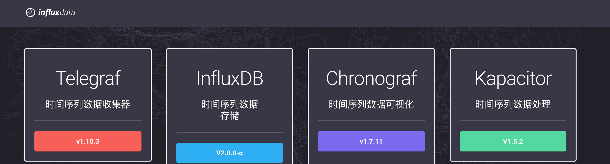

TICK是Telegraf、InfluxDB、Chronograf和Kapacitor四个软件的首字母缩写。它是Influxdata公司推出的监控套件，承包指标采集、分析、画图等时序数据库上下游的工作，有点模仿日志分析系统ELK套件的意思。

Influxdata的TICK运维栈主要有开源版本（MIT许可证）、InfluxEnterprise（企业版）和InfluxCloud （AWS云托管）三个版本，开源版本从0.11版本后就不再包括集群服务了，这也是从商业角度考虑的，要想使用集群服务需要购买企业版。开源版和企业版的主要区别就是企业版的InfluxDB和Kapacitor软件支持集群，而开源版不支持，此外企业版提供了先进的备份/恢复功能，而开源版本没有。这是开源软件常见的运作模式，通过代码开源吸引更多的人使用和参与开发，通过增值功能和服务支持获取商业利益。

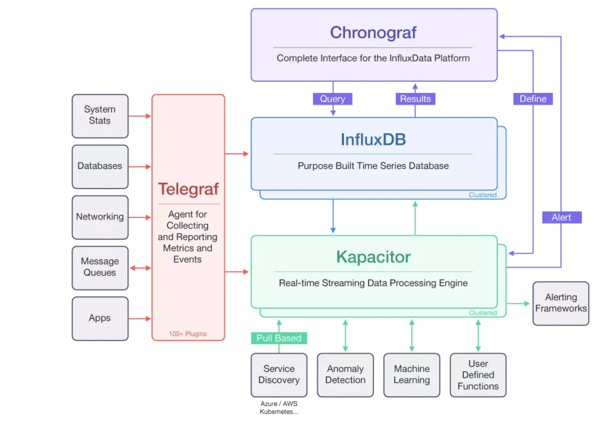


**使用Influxdata产品的大公司**


**Chronograf**

Chronograf是管理员用户界面和平台可视化引擎。它使你的基础设施的监视和告警变得易于设置和维护。它使用起来很简单，包括模板和库，可以让您快速构建仪表板，实现数据的实时可视化，并且可以轻松创建告警和自动化规则。

在TICK套件中，Chronograf可以被开源软件Grafana所替代，它们的功能类似，但后者更成熟些。Grafana支持Elasticsearch、InfluxDB等多种数据源，目前部署时常用Grafana替代Chronograf，此时运维栈变为TIGK。

**Kapacitor**

Kapacitor是时序数据分析、处理引擎。它可以处理来自InfluxDB的流数据和批量数据。Kapacitor允许插入用户自定义的逻辑或用户自定义的函数来处理基于动态门限的告警，匹配模式指标，计算统计异常，并根据这些告警执行特定动作，比如动态负载均衡。Kapacitor支持Email，HTTP，TCP，HipChat，OpsGenie，Alerta，Sensu，PagerDuty，Slack等多种方式告警。

**Kapacitor的特性：**

* 可以处理流数据和批量数据；

* 按计划从InfluxDB查询数据，或通过line协议从InfluxDB接收数据；

* 使用InfluxQL对数据做各种转换；

* 将转换后的数据存回InfluxDB；

* 添加用户自定义函数检测异常；

* 与HipChat, OpsGenie, Alerta, Sensu, PagerDuty, Slack等集成。

### influxdb 1.7 版本

yun安装influxdb telegraf chronograf kapacitor

```shell
yum install -y influxdb telegraf chronograf kapacitor
chown telegraf. /var/log/telegraf -R
service influxdb start
service telegraf start
service chronograf start
service kapacitor start
```
可以通过 http://server_ip:8888 访问 chronograf

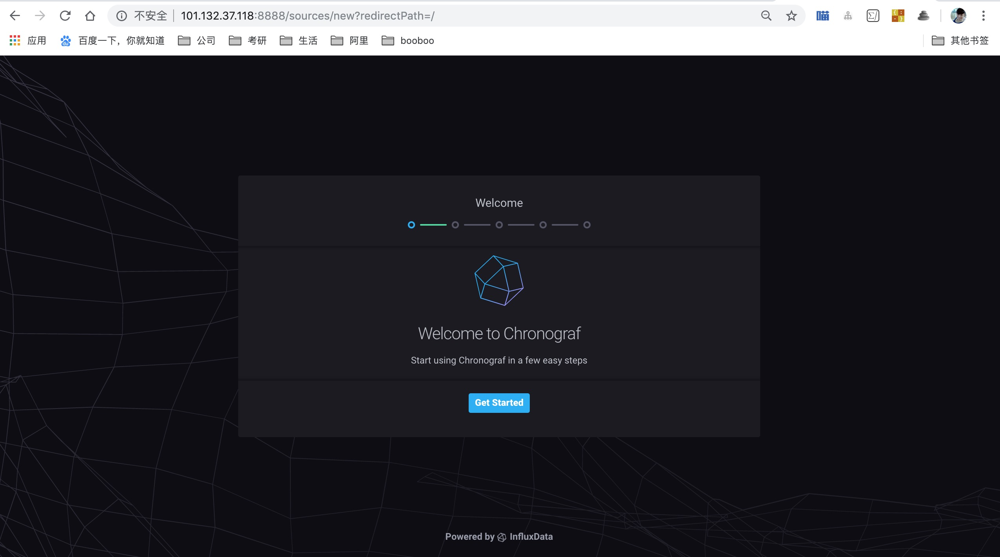

telegraf默认只搜集系统基础指标，如果要搜集其他指标，可根据帮助文档配置即可。

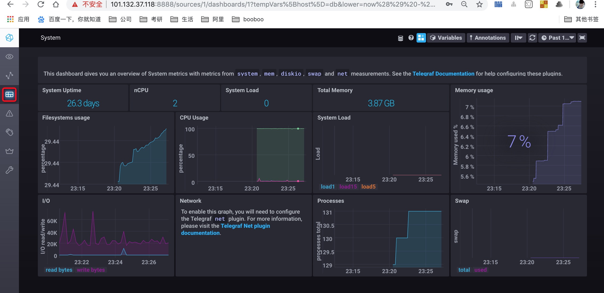

### 1. 安装influxdb 2.0最新版本

```shell
[root@db ~]# wget https://dl.influxdata.com/influxdb/releases/influxdb_2.0.0-alpha.9_linux_amd64.tar.gz
[root@db ~]# tar xvzf path/to/influxdb_2.0.0-alpha.9_linux_amd64.tar.gz
[root@db ~]# cp influxdb_2.0.0-alpha.9_linux_amd64/{influx,influxd} /usr/local/bin/
[root@db ~]# influxd --reporting-disabled &
[1] 7397
```

启动InfluxDB后，访问[demo]([http://101.132.37.118:9999](http://101.132.37.118:9999/))，单击开始进行账户配置`admin/Admin123`。

> 2.0版本和1.7版本的变化非常大，2019年5月1日～4日influxdata官网正在维护更新[v2.0.0-alpha.9](https://v2.docs.influxdata.com/v2.0/reference/release-notes/#v2-0-0-alpha-9-2019-05-01)，2.0直接在web界面操作所有产品，很像wavefront；目前在Alpha中，InfluxDB 2将influxdb chronograf kapacitor放在在单个二进制文件中。

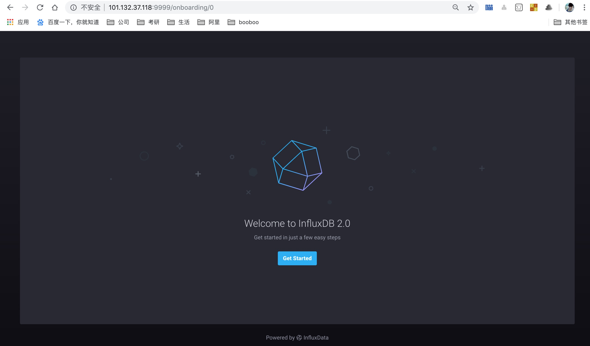

### 2. 安装telegraf

> 默认只开启操作系统信息采集

```shell
yum install -y telegraf
```

登录influxdb2.0界面选择“设置Settings”中的“telegraf”界面，选择“createconfigration”。

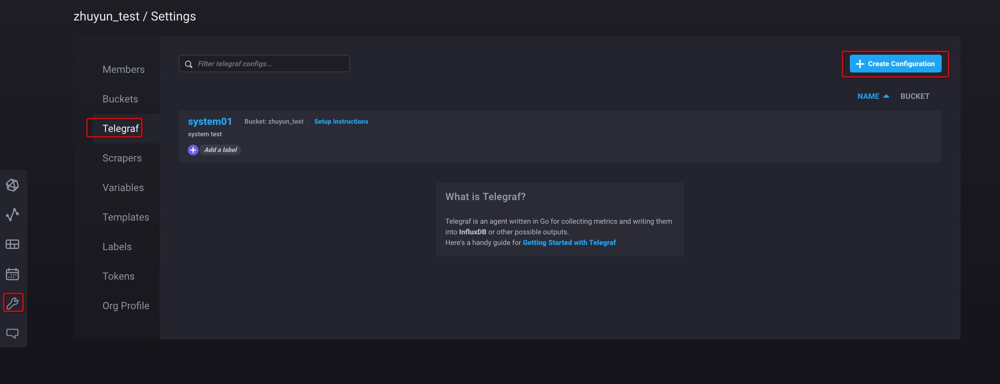

查看配置明细

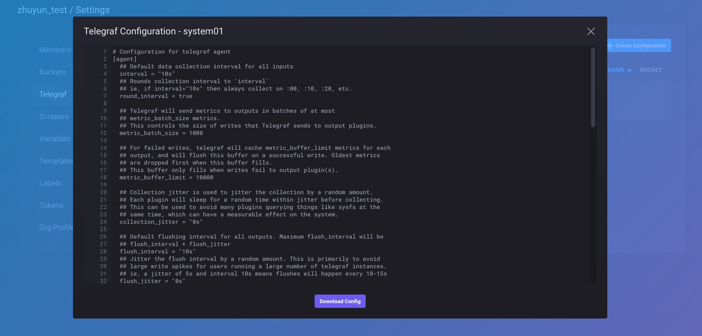

查看启动telegraf的步骤和命令

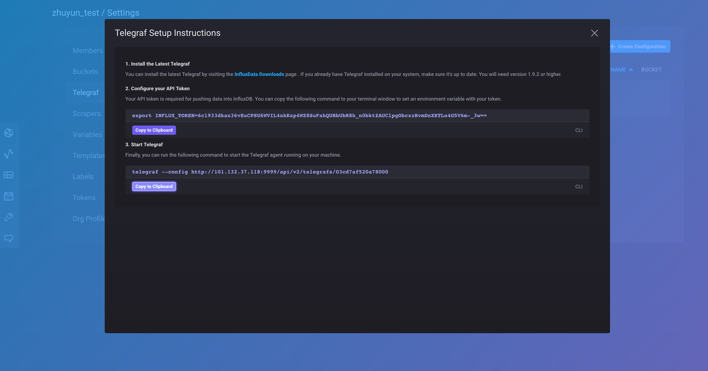

telegraf的配置文件是在web中进行管理，创建好后，本地的telegraf通过远程访问配置来启动服务

```
export INFLUX_TOKEN=6cl933dkax36vEuCPSU6WVIL4nkKsp4WZ8SuFahQUBbUbR8h_n0bktZAUClpgObcxzBvmDnXKTLo4G5V6m-_3w==
telegraf --config http://101.132.37.118:9999/api/v2/telegrafs/03cd7af520a78000 &
```

### 3. 查询数据

脚本模式

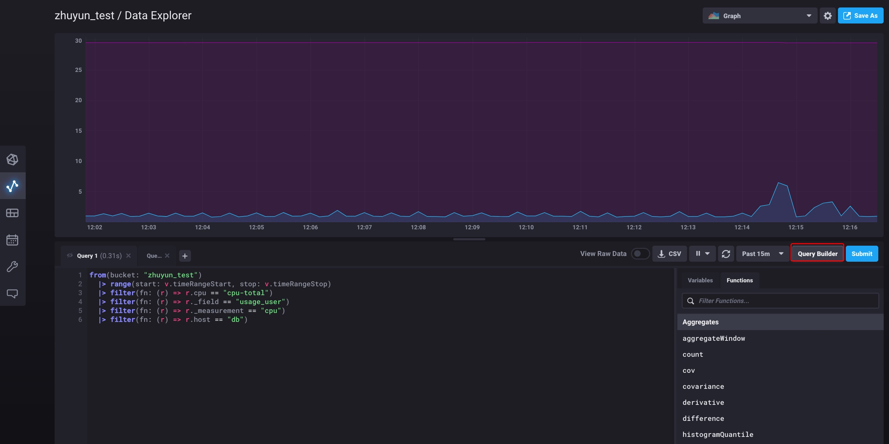

```sql
from(bucket: "zhuyun_test")
  |> range(start: v.timeRangeStart, stop: v.timeRangeStop)
  |> filter(fn: (r) => r.cpu == "cpu-total")
  |> filter(fn: (r) => r._field == "usage_user")
  |> filter(fn: (r) => r._measurement == "cpu")
  |> filter(fn: (r) => r.host == "db")
```

图像化模式

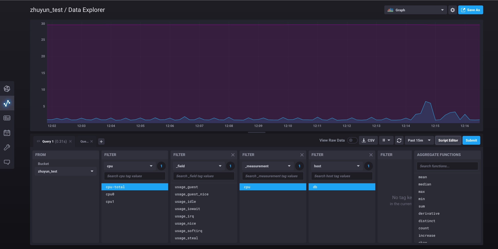

### 4. 可视化数据

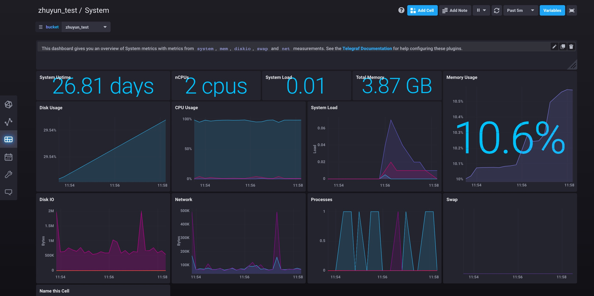

### 5. 处理数据

[从数据资源管理器中创建任务](https://v2.docs.influxdata.com/v2.0/process-data/manage-tasks/create-task/#create-a-task-from-the-data-explorer)

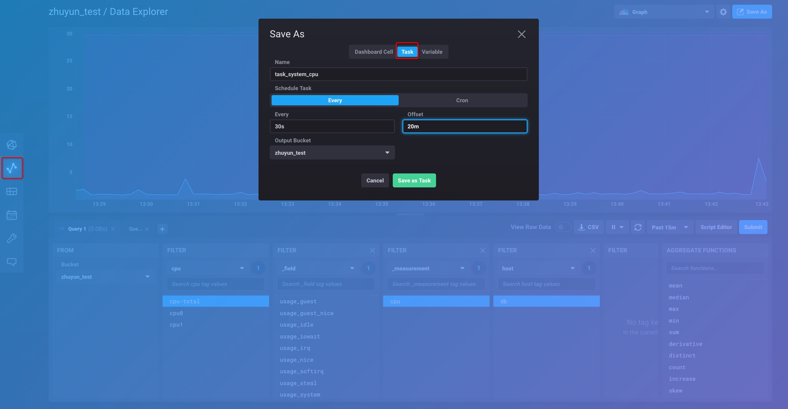

查看任务代码

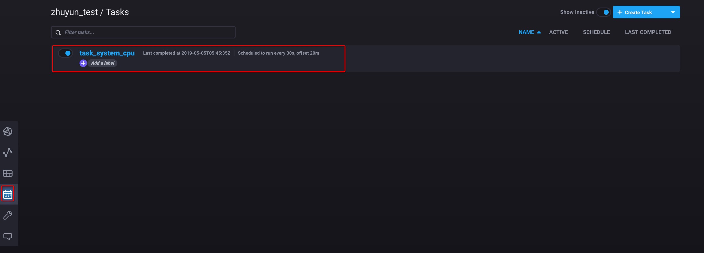

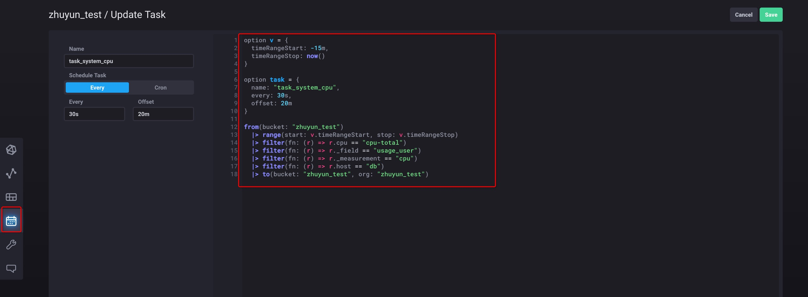

### 6. 管理组织

待补充

### 7. 管理用户

待补充

### 8. 安全和授权

待补充
