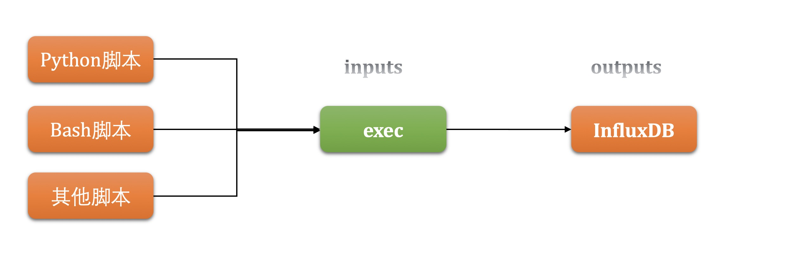

<!-- TOC depthFrom:1 depthTo:6 withLinks:1 updateOnSave:1 orderedList:0 -->

- [InfluxDB Line Protocol](#influxdb-line-protocol)
	- [开始之前](#开始之前)
	- [JSON VS INFLUX](#json-vs-influx)
	- [InfluxDB Line Protocol调研明细](#influxdb-line-protocol调研明细)
		- [语法说明](#语法说明)
			- [数据类型](#数据类型)
			- [引用](#引用)
			- [特殊字符和关键字](#特殊字符和关键字)
		- [测试1：使用`inputs.exec`执行bash脚本并将指标数据写入influxdb](#测试1使用inputsexec执行bash脚本并将指标数据写入influxdb)
			- [步骤概览](#步骤概览)
			- [自动安装配置脚本](#自动安装配置脚本)
			- [查看influxdb中存入的指标数据](#查看influxdb中存入的指标数据)
	- [参考](#参考)

<!-- /TOC -->

# InfluxDB Line Protocol


## 开始之前

为了拓展Telegraf采集的指标，有两种方式：
1. GO二次开发
2. `inpusts.exec`插件执行第三方脚本（bash、python等）

第一种有GO语言的优势但难度大；第二种开发难度降低，但语言不统一且执行速度没有go快。

考虑到快速添加指标，目前先优先选择第二种方式。

Telegraf的Inputs插件exec可以通过额外执行其他脚本的方式来将指标采集至influxdb数据库，原理如下图：




## JSON VS INFLUX

Exec输入插件将支持的Telegraf输入数据格式 （InfluxDB线路协议，JSON，Graphite，Value，Nagios，Collectd和Dropwizard）解析为指标。每个Telegraf指标包括测量名称，标签，字段和时间戳。

`inpusts.exec`支持的[输入协议](https://docs.influxdata.com/telegraf/v1.11/data_formats/input/)有多种，此处经过综合考虑，选择`influx`格式，接下去将全面调研该协议。

* 对于python脚本来说，输出[json格式](https://docs.influxdata.com/telegraf/v1.11/data_formats/input/json/)也是一个很好的选择，但是json格式的缺点是，每一个输出都需要在`inputs.exec`配置文件中注明`tag`和`field`，增加了配置的难度，不易维护；
* [inlux格式](https://docs.influxdata.com/telegraf/v1.11/data_formats/input/influx/)将指标的`tag`和`field`在脚本中进行维护，大大降低了`inputs.exec`的配置难度。


## InfluxDB Line Protocol调研明细

### 语法说明

|measurement|tag_set| field_set| timestamp|
|:--|:--|:--|:--|
|`测量(表)`|`标记集`|`字段集`|`时间戳`|

单行Line Protocol表示InfluxDB中的一个数据点。它通知InfluxDB点的测量，标记集，字段集和时间戳。

对比关系型数据库有助于理解协议中的组成：

* `测量`：理解为关系型数据库的`表`，必须；
* `标记`：理解为添加了索引的`列`，可选；
* `字段`：理解为没有索引的`列`，可选；
* `时间戳`：理解为纳秒级精度Unix时间戳的`列`，可选。


格式注意：

1. `测量`和`标记`之间`逗号`连接，不可以有空格 `cpu,host=server01 usage_idle=0.99`；
2. `测量`和`字段集`之间`空格`分隔 `cpu usage_idle=0.99`；
3. 多个`标记值对`之间`逗号`分隔,`标记键`和`值`之间`=`分隔 `cpu host=server01,cpu=cpu_total usage_idle=0.99`；
4. 多个`字段值对`之间`逗号`分隔,`字段键`和`值`之间`=`分隔 `cpu host=server01,cpu=cpu_total usage_idle=0.99,usage_user=1.01`


#### 数据类型


#### 引用

#### 特殊字符和关键字

### 测试1：使用`inputs.exec`执行bash脚本并将指标数据写入influxdb

#### 步骤概览

1. 安装infludxdb并启动；
2. 安装telegraf；
3. 编写bash脚本；
4. 配置telegraf的inputs.exec插件；
5. 启动telegraf；
6. 查看influxdb中存入的指标数据。

#### 自动安装配置脚本

```
username=admin
password=Admin123
IP=`ip a| grep inet | grep -v 'inet6\|127.0.0.1' | awk '{print $2}' | awk -F / '{print $1}'`
edition=`cat /etc/redhat-release | awk '{print $4}' | awk -F . '{print $1}'`

cat > /etc/yum.repos.d/influxdb.repo << END
[influxdb]
name = InfluxDB Repository - RHEL \$releasever
baseurl = https://repos.influxdata.com/rhel/\$releasever/\$basearch/stable
enabled = 1
gpgcheck = 1
gpgkey = https://repos.influxdata.com/influxdb.key
END

yum -y install influxdb
yum -y install telegraf

mv /etc/telegraf/telegraf.conf /etc/telegraf/telegraf.conf.bac

cat > /etc/telegraf/telegraf.conf << END
[global_tags]
  instanceid = "aa123"
[agent]
  interval = "30s"
  round_interval = true
  metric_batch_size = 1000
  metric_buffer_limit = 10000
  collection_jitter = "0s"
  flush_interval = "10s"
  flush_jitter = "0s"
  precision = ""
  hostname = "influxdb"
  omit_hostname = false
[[inputs.exec]]
    commands = [
      "/tmp/test01.sh"
    ]
    interval = "2s"
    timeout = "5s"
    data_format = "influx"

[[outputs.influxdb]]
  urls = ["http://$IP:8086/debug/vars"]
  database = "telegraf"
  skip_database_creation = false
  timeout = "5s"
  username = "admin"
  password = "Admin123"

END  

cat > /tmp/test01.sh << ENDF
echo 'example_22,tag1="a1",tag2=b1 i="superman",j=13,k="cloudcare"'
echo 'example_22,tag1="a",tag2=b i="tom",j=12,k="cloudcare"'
ENDF

chmod a+x /tmp/test01.sh

if [ "$edition" == 7 ]
then
        systemctl start influxdb
        systemctl start telegraf
else
        service influxdb start
        service telegraf start
fi

influx -execute "create user $username with password '$password' with all privileges"

```

#### 查看influxdb中存入的指标数据

```mysql
> select * from example_22 limit 3;
name: example_22
time                 host          i        instanceid j  k         tag1 tag2
----                 ----          -        ---------- -  -         ---- ----
2019-06-24T06:47:36Z telegraf_test superman aa123      13 cloudcare a1   b1
2019-06-24T06:47:36Z telegraf_test tom      aa123      12 cloudcare a    b
```

**思考：**

1. 可以有多个脚本吗？
2. 可以有多个`inpust.exec`吗？
3. 字符串一定要加双引号吗？
4. 如何区分浮点和整型？
5. 时间戳不写默认使用的是什么时间？

  ```
  数据点的时间戳，以纳秒级精度Unix时间为准。时间戳在线路协议中是可选的。如果没有为数据点指定时间戳，则InfluxDB使用UTC中的服务器本地纳秒时间戳。
  使用网络时间协议（NTP）同步主机之间的时间。InfluxDB使用主机的UTC本地时间为数据分配时间戳; 如果主机的时钟与NTP不同步，写入InfluxDB的数据的时间戳可能不准确。
  ```


## 参考

* [InfluxDB Line Protocol官方帮助](https://docs.influxdata.com/influxdb/v1.7/write_protocols/line_protocol_tutorial/)
