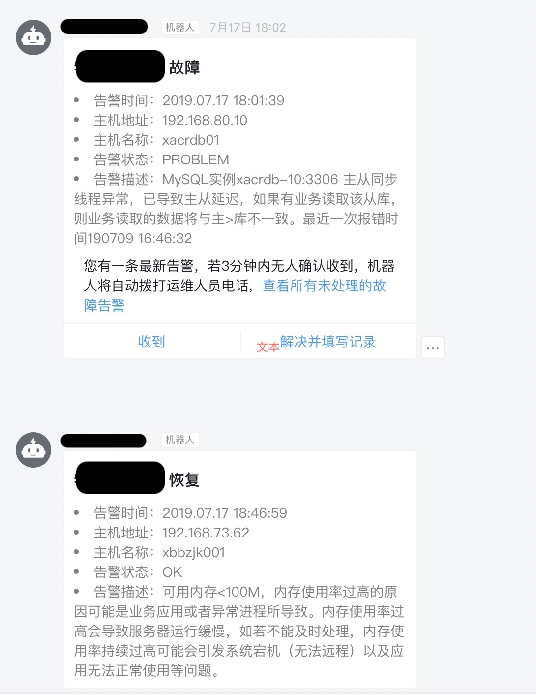
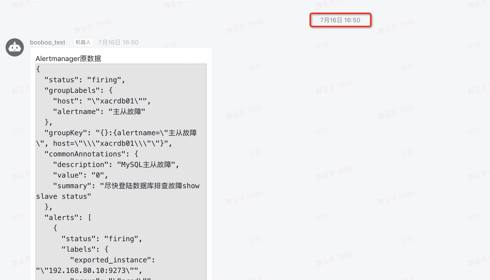

<!-- TOC depthFrom:1 depthTo:6 withLinks:1 updateOnSave:1 orderedList:0 -->

- [AlertManager案例研究](#alertmanager案例研究)
	- [问题1：未恢复的告警被恢复](#问题1未恢复的告警被恢复)
		- [解决方法](#解决方法)
		- [案例明细](#案例明细)
			- [Prometheus告警规则](#prometheus告警规则)
			- [AlertManager配置](#alertmanager配置)
		- [配置文件解析](#配置文件解析)
			- [全局配置 resolve_timeout](#全局配置-resolvetimeout)
			- [判断是否为同一个告警的算法是什么？](#判断是否为同一个告警的算法是什么)
		- [解决过程](#解决过程)
			- [1. 通过bash脚本模拟主从延迟报错数据](#1-通过bash脚本模拟主从延迟报错数据)
			- [2. 使用inputs.exec执行脚本](#2-使用inputsexec执行脚本)
			- [3. prometheus拉去数据](#3-prometheus拉去数据)
			- [4. prometheus中删除`slave_retrieved_gtid_set`和`slave_executed_gtid_set`标签](#4-prometheus中删除slaveretrievedgtidset和slaveexecutedgtidset标签)
			- [5. 查看Prometheus指标标签是否被删除](#5-查看prometheus指标标签是否被删除)
			- [6. 配置Prometheus Rule](#6-配置prometheus-rule)
			- [7. 配置AlertManager](#7-配置alertmanager)
			- [8. 观察AlertManager告警情况](#8-观察alertmanager告警情况)
			- [9. 是否还存在未恢复的告警被恢复？](#9-是否还存在未恢复的告警被恢复)
			- [10. 是否不再重复告警？](#10-是否不再重复告警)
	- [问题2：分组后的告警重复接口重复输出](#问题2分组后的告警重复接口重复输出)
		- [问题描述](#问题描述)
			- [prometheus告警规则](#prometheus告警规则)
		- [测试1——通过server进行分组且分组等待和合并时间为10s](#测试1通过server进行分组且分组等待和合并时间为10s)
			- [配置文件](#配置文件)
			- [alertmanager原数据](#alertmanager原数据)
		- [测试2——通过server进行分组且分组等待和合并时间为60s](#测试2通过server进行分组且分组等待和合并时间为60s)
			- [配置文件](#配置文件)
			- [alertmanager原数据](#alertmanager原数据)
		- [总结](#总结)

<!-- /TOC -->

# AlertManager案例研究

## 问题1：未恢复的告警被恢复



### 解决方法

使用`regex`匹配当前`Target`实例的所有标签，并将符合`regex`规则的标签从Target实例中移除`labeldrop`。`labelkeep`正好相反，会移除那些不匹配`regex`定义的所有标签。

```yaml
 metric_relabel_configs:
    - regex: 'slave_.*_gtid_set'
      action: labeldrop
```

### 案例明细

#### Prometheus告警规则

> `mysql_slave_t_rule.yml`

```yaml
groups:
- name: mysql_slave_t_rule
  rules:
  - alert: "MySQL 主从异常"
    expr: sum_over_time(mysql_slave_slave_sql_running[5m]) == 0 or sum_over_time(mysql_slave_slave_io_running[5m]) == 0
    for: 5m
    labels:
      severity: average
    annotations:
      description: "MySQL实例{{ $labels.server }} 主从同步线程异常，已导致主从延迟，如果有业务读取该从库，则业务读取的数据将与主>库不一致。最近一次报错时间{{ $labels.slave_last_sql_error_timestamp }}"
      suggestion: "请尽快登陆数据库执行show slave status 进行排查。"
      server: "{{ $labels.server }}"
```

#### AlertManager配置

> `alertmanager.yml`

```yaml
global:
  resolve_timeout: 5m
route:
  group_by: ['instance','alertname']
  group_wait: 10s
  group_interval: 10s
  repeat_interval: 24h
  receiver: 'web.hook'
receivers:
- name: 'web.hook'
  webhook_configs:
  - url: 'http://121.199.41.203:5555/send'
inhibit_rules:
  - source_match:
      severity: 'critical'
    target_match:
      severity: 'warning'
    equal: ['alertname', 'dev', 'instance']
```

此时故障并没有真的恢复，但是由于Alertmanager等了5分钟没有相同的告警出现，因此就将告警恢复。


### 配置文件解析

[帮助文档](https://yunlzheng.gitbook.io/prometheus-book/parti-prometheus-ji-chu/alert/alert-manager-config)

```yaml
global:
  resolve_timeout: 5m
route:
  group_by: ['instance_id']
  group_wait: 10s
  group_interval: 10s
  repeat_interval: 24h
  receiver: 'web.hook'
receivers:
- name: 'web.hook'
  webhook_configs:
  - url: 'http://localhost:5001/webhook/api'
inhibit_rules:
  - source_match:
      severity: 'critical'
    target_match:
      severity: 'warning'
    equal: ['alertname', 'dev', 'instance']
```

* 全局配置（global）：用于定义一些全局的公共参数，如全局的SMTP配置，Slack配置等内容；
* 模板（templates）：用于定义告警通知时的模板，如HTML模板，邮件模板等；
* 告警路由（route）：根据标签匹配，确定当前告警应该如何处理；
* 接收人（receivers）：接收人是一个抽象的概念，它可以是一个邮箱也可以是微信，Slack或者Webhook等，接收人一般配合告警路由使用；
* 抑制规则（inhibit_rules）：合理设置抑制规则可以减少垃圾告警的产生


#### 全局配置 resolve_timeout

该参数定义了当Alertmanager持续多长时间未接收到告警后，标记告警状态为resolved（已解决）。该参数的定义可能会影响到告警恢复通知的接收时间，可根据自己的实际场景进行定义，其默认值为5分钟。


#### 判断是否为同一个告警的算法是什么？

所有的tag一致则Prometheus认为是同一个告警：

在本次案例中，由于`slave_executed_gtid_set`和`slave_retrieved_gtid_set`这两个标签的值会不停地发生变化；prometheus根据这两个标签值，每次都会判断为一个新报警产生。

```
✔{group="prod",host="xacrdb01",instance="192.168.80.10:9273",job="telegraf",server="xacrdb-10:3306",slave_executed_gtid_set="37d57e64-ee22-11e8-ae5a-001cc4935172:70443-70620:231645-27443480:28835731:28836861:28838414:28841453:28842150:28843451:28843635:28843649:28843679:28843698:28849260:28849309:28849408:28849783:28849811:28849840:28850344, c7e4310f-ee18-11e8-ae1c-00237dce8622:1-115029",slave_last_error="Error 'Table 'xicrm.crm_vip' doesn't exist' on query. Default database: 'xicrm_nnoe_0000'. Query: '/* c0a851d315614589637493868d0054/9.74.69.13.39.18.46.38.34// *//*DRDS /172.20.240.41/efdffecc7800000/ */ALTER TABLE `xicrm`.`crm_vip` MODIFY COLUMN `district` INT(4) NULL COMMENT '区域' AFTER `city`'",slave_last_sql_error="Error 'Table 'xicrm.crm_vip' doesn't exist' on query. Default database: 'xicrm_nnoe_0000'. Query: '/* c0a851d315614589637493868d0054/9.74.69.13.39.18.46.38.34// *//*DRDS /172.20.240.41/efdffecc7800000/ */ALTER TABLE `xicrm`.`crm_vip` MODIFY COLUMN `district` INT(4) NULL COMMENT '区域' AFTER `city`'",slave_last_sql_error_timestamp="190709 16:46:32",slave_master_host="192.168.80.94",slave_master_info_file="mysql.slave_master_info",slave_master_log_file="mysql-bin.000270",slave_master_user="repl",slave_master_uuid="37d57e64-ee22-11e8-ae5a-001cc4935172",slave_relay_log_file="relaylog.000368",slave_relay_master_log_file="mysql-bin.000257",slave_retrieved_gtid_set="37d57e64-ee22-11e8-ae5a-001cc4935172:231645-30659540",slave_slave_io_state="Waiting for master to send event",slave_until_condition="None"}
✔{group="prod",host="xacrdb01",instance="192.168.80.10:9273",job="telegraf",server="xacrdb-10:3306",slave_executed_gtid_set="37d57e64-ee22-11e8-ae5a-001cc4935172:70443-70620:231645-27443480:28835731:28836861:28838414:28841453:28842150:28843451:28843635:28843649:28843679:28843698:28849260:28849309:28849408:28849783:28849811:28849840:28850344, c7e4310f-ee18-11e8-ae1c-00237dce8622:1-115029",slave_last_error="Error 'Table 'xicrm.crm_vip' doesn't exist' on query. Default database: 'xicrm_nnoe_0000'. Query: '/* c0a851d315614589637493868d0054/9.74.69.13.39.18.46.38.34// *//*DRDS /172.20.240.41/efdffecc7800000/ */ALTER TABLE `xicrm`.`crm_vip` MODIFY COLUMN `district` INT(4) NULL COMMENT '区域' AFTER `city`'",slave_last_sql_error="Error 'Table 'xicrm.crm_vip' doesn't exist' on query. Default database: 'xicrm_nnoe_0000'. Query: '/* c0a851d315614589637493868d0054/9.74.69.13.39.18.46.38.34// *//*DRDS /172.20.240.41/efdffecc7800000/ */ALTER TABLE `xicrm`.`crm_vip` MODIFY COLUMN `district` INT(4) NULL COMMENT '区域' AFTER `city`'",slave_last_sql_error_timestamp="190709 16:46:32",slave_master_host="192.168.80.94",slave_master_info_file="mysql.slave_master_info",slave_master_log_file="mysql-bin.000270",slave_master_user="repl",slave_master_uuid="37d57e64-ee22-11e8-ae5a-001cc4935172",slave_relay_log_file="relaylog.000368",slave_relay_master_log_file="mysql-bin.000257",slave_retrieved_gtid_set="37d57e64-ee22-11e8-ae5a-001cc4935172:231645-30657759",slave_slave_io_state="Waiting for master to send event",slave_until_condition="None"}
```


### 解决过程

**将变化的标签替换掉**

`metric_relabel_configs`

**思考：该值被替换掉会降低故障现场信息的准确性，但从整体来看，替换掉能够解决重复告警和重复恢复问题，是值得的。**


#### 1. 通过bash脚本模拟主从延迟报错数据


```bash
[root@tick telegraf]# cat > /usr/local/cloudcare/telegraf/bash_scripts/relabel_configs.sh << ENDF
echo 'example_01,tag1="a1",tag2=b1 i="superman",dfdj=13,k="cloudcare"'
echo 'example_mysql,group="prod",host="xacrdb01",instance="192.168.80.10:9273",slave_executed_gtid_set="37d57e64-ee22-11e8-ae5a-001cc4935172:70443-70620:231645-27443480:28835731:28836861:28838414:28841453:28842150:28843451:28843635:28843649:28843679:28843698:28849260:28849309:28849408:28849783:28849811:28849840:28850344\,c7e4310f-ee18-11e8-ae1c-00237dce8622:1-115029",slave_relay_master_log_file="mysql-bin.000257",slave_retrieved_gtid_set="37d57e64-ee22-11e8-ae5a-001cc4935172:231645-30643531" slave_slave_sql_running=0i'
ENDF
```


#### 2. 使用inputs.exec执行脚本


```bash
[root@tick telegraf]# cat > /etc/telegraf/telegraf.d/exec_t.conf << ENDF
[[inputs.exec]]
  commands = [
    "/bin/bash /usr/local/cloudcare/telegraf/bash_scripts/relabel_configs.sh"
  ]
  interval = "10s"
  timeout = "5s"
  data_format = "influx"


[root@tick telegraf]# cat /etc/telegraf/telegraf.conf

[global_tags]
[agent]
  logfile = "/var/log/telegraf/telegraf.log"
  logfile_rotation_interval = "7d"
  logfile_rotation_max_size = "100MB"
  logfile_rotation_max_archives = 5
  interval = "60s"
  round_interval = true
  metric_batch_size = 1000
  metric_buffer_limit = 10000
  collection_jitter = "0s"
  flush_interval = "10s"
  flush_jitter = "0s"
  precision = ""
  hostname = "influxdb"
  omit_hostname = false
[[inputs.cpu]]
  percpu = true
  totalcpu = true
  collect_cpu_time = false
  report_active = false
[[inputs.disk]]
  ignore_fs = ["tmpfs", "devtmpfs", "devfs", "iso9660", "overlay", "aufs", "squashfs"]
[[inputs.diskio]]
[[inputs.kernel]]
[[inputs.mem]]
[[inputs.processes]]
[[inputs.swap]]
[[inputs.system]]
[[inputs.influxdb]]
  urls = ["http://172.19.34.226:8086/debug/vars"]

[[outputs.influxdb]]
  urls = ["http://172.19.34.226:8086"]
  database = "telegraf"
  skip_database_creation = false
  timeout = "5s"
  username = "admin"
  password = "Admin123"

[[outputs.prometheus_client]]
   listen = ":9273"
```

重启服务 `systemctl restart telegraf`

#### 3. prometheus拉去数据

http://47.100.48.213:9273/metrics

```
example_mysql_slave_slave_sql_running{group="\"prod\"",host="\"xacrdb01\"",instance="\"192.168.80.10:9273\"",slave_executed_gtid_set="\"37d57e64-ee22-11e8-ae5a-001cc4935172:70443-70620:231645-27443480:28835731:28836861:28838414:28841453:28842150:28843451:28843635:28843649:28843679:28843698:28849260:28849309:28849408:28849783:28849811:28849840:28850344,c7e4310f-ee18-11e8-ae1c-00237dce8622:1-115029\"",slave_relay_master_log_file="\"mysql-bin.000257\"",slave_retrieved_gtid_set="\"37d57e64-ee22-11e8-ae5a-001cc4935172:231645-30643531\""} 0
```


#### 4. prometheus中删除`slave_retrieved_gtid_set`和`slave_executed_gtid_set`标签

修改prometheus主配置文件 `prometheus.yml`

```yaml
global:
  scrape_interval: 60s
  evaluation_interval: 60s
  external_labels:
    project: 'TICK'


alerting:
  alertmanagers:
  - static_configs:
    - targets: ["127.0.0.1:9093"]

rule_files:
   - '/usr/local/cloudcare/prometheus/rules/*.yml'

scrape_configs:
  - job_name: 'autojson'
    file_sd_configs:
    - files:
      - '/usr/local/cloudcare/prometheus/json/*.json'

  - job_name: 'telegraf'
    static_configs:
    - targets: ['localhost:9273']

    metric_relabel_configs:
    - regex: 'slave_.*_gtid_set'
      action: labeldrop
```

该配置会使用regex匹配当前Target实例的所有标签，并将符合regex规则的标签从Target实例中移除。labelkeep正好相反，会移除那些不匹配regex定义的所有标签。

```yaml
metric_relabel_configs:
    - regex: 'slave_.*_gtid_set'
      action: labeldrop
```

#### 5. 查看Prometheus指标标签是否被删除

```
✔{group="prod",host="xacrdb01",instance="192.168.80.10:9273",job="telegraf",server="xacrdb-10:3306",slave_last_error="Error 'Table 'xicrm.crm_vip' doesn't exist' on query. Default database: 'xicrm_nnoe_0000'. Query: '/* c0a851d315614589637493868d0054/9.74.69.13.39.18.46.38.34// *//*DRDS /172.20.240.41/efdffecc7800000/ */ALTER TABLE `xicrm`.`crm_vip` MODIFY COLUMN `district` INT(4) NULL COMMENT '区域' AFTER `city`'",slave_last_sql_error="Error 'Table 'xicrm.crm_vip' doesn't exist' on query. Default database: 'xicrm_nnoe_0000'. Query: '/* c0a851d315614589637493868d0054/9.74.69.13.39.18.46.38.34// *//*DRDS /172.20.240.41/efdffecc7800000/ */ALTER TABLE `xicrm`.`crm_vip` MODIFY COLUMN `district` INT(4) NULL COMMENT '区域' AFTER `city`'",slave_last_sql_error_timestamp="190709 16:46:32",slave_master_host="192.168.80.94",slave_master_info_file="mysql.slave_master_info",slave_master_log_file="mysql-bin.000270",slave_master_user="repl",slave_master_uuid="37d57e64-ee22-11e8-ae5a-001cc4935172",slave_relay_log_file="relaylog.000368",slave_relay_master_log_file="mysql-bin.000257",slave_slave_io_state="System lock",slave_until_condition="None"}
✔{group="prod",host="xacrdb01",instance="192.168.80.10:9273",job="telegraf",server="xacrdb-10:3306",slave_executed_gtid_set="37d57e64-ee22-11e8-ae5a-001cc4935172:70443-70620:231645-27443480:28835731:28836861:28838414:28841453:28842150:28843451:28843635:28843649:28843679:28843698:28849260:28849309:28849408:28849783:28849811:28849840:28850344, c7e4310f-ee18-11e8-ae1c-00237dce8622:1-115029",slave_last_error="Error 'Table 'xicrm.crm_vip' doesn't exist' on query. Default database: 'xicrm_nnoe_0000'. Query: '/* c0a851d315614589637493868d0054/9.74.69.13.39.18.46.38.34// *//*DRDS /172.20.240.41/efdffecc7800000/ */ALTER TABLE `xicrm`.`crm_vip` MODIFY COLUMN `district` INT(4) NULL COMMENT '区域' AFTER `city`'",slave_last_sql_error="Error 'Table 'xicrm.crm_vip' doesn't exist' on query. Default database: 'xicrm_nnoe_0000'. Query: '/* c0a851d315614589637493868d0054/9.74.69.13.39.18.46.38.34// *//*DRDS /172.20.240.41/efdffecc7800000/ */ALTER TABLE `xicrm`.`crm_vip` MODIFY COLUMN `district` INT(4) NULL COMMENT '区域' AFTER `city`'",slave_last_sql_error_timestamp="190709 16:46:32",slave_master_host="192.168.80.94",slave_master_info_file="mysql.slave_master_info",slave_master_log_file="mysql-bin.000270",slave_master_user="repl",slave_master_uuid="37d57e64-ee22-11e8-ae5a-001cc4935172",slave_relay_log_file="relaylog.000368",slave_relay_master_log_file="mysql-bin.000257",slave_retrieved_gtid_set="37d57e64-ee22-11e8-ae5a-001cc4935172:231645-30686260",slave_slave_io_state="Waiting for master to send event",slave_until_condition="None"}
```


#### 6. 配置Prometheus Rule

配置Prometheus的rules，来触发告警。

```yaml
groups:
- name: test_rule
  rules:
  - alert: "主从故障"
    expr: rate(example_mysql_slave_slave_sql_running[5m]) >= 0
    for: 1m
    labels:
      severity: average
    annotations:
      description: "MySQL主从故障"
      summary: "尽快登陆数据库排查故障show slave status"
      value: "{{ $value }}"
rate(example_mysql_slave_slave_sql_running[5m]) 持续1分钟 >= 0
```


#### 7. 配置AlertManager


```yaml
global:
  resolve_timeout: 5m

route:
  group_by: ['alertname', 'host']
  group_wait: 5s
  group_interval: 1h
  repeat_interval: 24h
  receiver: 'web.hook'
receivers:
- name: 'web.hook'
  webhook_configs:
  - url: 'http://localhost:5001/webhook/api'
inhibit_rules:
  - source_match:
      severity: 'critical'
    target_match:
      severity: 'warning'
    equal: ['alertname', 'dev', 'instance']


route:
  group_by: ['alertname', 'host'] # 按照告警名称和主机名进行分组
  group_wait: 5s # 分组等待5s后进行合并
  group_interval: 1h # 下一次分组告警等待1h
  repeat_interval: 24h # 24小时之后重复告警
```  


#### 8. 观察AlertManager告警情况

将告警原数据通过钉钉发出来:

* 第一次告警时间为：7月16日 16:50
* 告警内容:

```json
{
  "status": "firing",
  "groupLabels": {
    "host": "\"xacrdb01\"",
    "alertname": "主从故障"
  },
  "groupKey": "{}:{alertname=\"主从故障\", host=\"\\\"xacrdb01\\\"\"}",
  "commonAnnotations": {
    "description": "MySQL主从故障",
    "value": "0",
    "summary": "尽快登陆数据库排查故障show slave status"
  },
  "alerts": [
    {
      "status": "firing",
      "labels": {
        "exported_instance": "\"192.168.80.10:9273\"",
        "group": "\"prod\"",
        "severity": "average",
        "job": "telegraf",
        "project": "TICK",
        "instance": "localhost:9273",
        "host": "\"xacrdb01\"",
        "alertname": "主从故障",
        "slave_relay_master_log_file": "\"mysql-bin.000257\""
      },
      "endsAt": "0001-01-01T00:00:00Z",
      "generatorURL": "http://tick:9090/graph?g0.expr=rate%28example_mysql_slave_slave_sql_running%5B5m%5D%29+%3E%3D+0&g0.tab=1",
      "startsAt": "2019-07-16T16:50:43.079745961+08:00",
      "annotations": {
        "description": "MySQL主从故障",
        "value": "0",
        "summary": "尽快登陆数据库排查故障show slave status"
      }
    }
  ],
  "version": "4",
  "receiver": "web\\.hook",
  "externalURL": "http://tick:9093",
  "commonLabels": {
    "exported_instance": "\"192.168.80.10:9273\"",
    "group": "\"prod\"",
    "severity": "average",
    "job": "telegraf",
    "project": "TICK",
    "instance": "localhost:9273",
    "host": "\"xacrdb01\"",
    "alertname": "主从故障",
    "slave_relay_master_log_file": "\"mysql-bin.000257\""
  }
}
```



#### 9. 是否还存在未恢复的告警被恢复？

没有再出现了。

#### 10. 是否不再重复告警？

持续观察4天，没有再重复告警了，统计如下：

|告警次数|时间|
|:--|:--|
|第一次|`7月16日 16:50`|
|第二次|`7月17日 17:50`|
|第一次|`7月18日 18:50`|

**思考：为什么会比24h多了1个小时？**

第二次:Alertmanager原数据

```json
{
  "status": "firing",
  "groupLabels": {
    "host": "\"xacrdb01\"",
    "alertname": "主从故障"
  },
  "groupKey": "{}:{alertname=\"主从故障\", host=\"\\\"xacrdb01\\\"\"}",
  "commonAnnotations": {
    "description": "MySQL主从故障",
    "value": "0",
    "summary": "尽快登陆数据库排查故障show slave status"
  },
  "alerts": [
    {
      "status": "firing",
      "labels": {
        "exported_instance": "\"192.168.80.10:9273\"",
        "group": "\"prod\"",
        "severity": "average",
        "job": "telegraf",
        "project": "TICK",
        "instance": "localhost:9273",
        "host": "\"xacrdb01\"",
        "alertname": "主从故障",
        "slave_relay_master_log_file": "\"mysql-bin.000257\""
      },
      "endsAt": "0001-01-01T00:00:00Z",
      "generatorURL": "http://tick:9090/graph?g0.expr=rate%28example_mysql_slave_slave_sql_running%5B5m%5D%29+%3E%3D+0&g0.tab=1",
      "startsAt": "2019-07-16T16:50:43.079745961+08:00",
      "annotations": {
        "description": "MySQL主从故障",
        "value": "0",
        "summary": "尽快登陆数据库排查故障show slave status"
      }
    }
  ],
  "version": "4",
  "receiver": "web\\.hook",
  "externalURL": "http://tick:9093",
  "commonLabels": {
    "exported_instance": "\"192.168.80.10:9273\"",
    "group": "\"prod\"",
    "severity": "average",
    "job": "telegraf",
    "project": "TICK",
    "instance": "localhost:9273",
    "host": "\"xacrdb01\"",
    "alertname": "主从故障",
    "slave_relay_master_log_file": "\"mysql-bin.000257\""
  }
}
```

第三次:Alertmanager原数据

```json
{
  "status": "firing",
  "groupLabels": {
    "host": "\"xacrdb01\"",
    "alertname": "主从故障"
  },
  "groupKey": "{}:{alertname=\"主从故障\", host=\"\\\"xacrdb01\\\"\"}",
  "commonAnnotations": {
    "description": "MySQL主从故障",
    "value": "0",
    "summary": "尽快登陆数据库排查故障show slave status"
  },
  "alerts": [
    {
      "status": "firing",
      "labels": {
        "exported_instance": "\"192.168.80.10:9273\"",
        "group": "\"prod\"",
        "severity": "average",
        "job": "telegraf",
        "project": "TICK",
        "instance": "localhost:9273",
        "host": "\"xacrdb01\"",
        "alertname": "主从故障",
        "slave_relay_master_log_file": "\"mysql-bin.000257\""
      },
      "endsAt": "0001-01-01T00:00:00Z",
      "generatorURL": "http://tick:9090/graph?g0.expr=rate%28example_mysql_slave_slave_sql_running%5B5m%5D%29+%3E%3D+0&g0.tab=1",
      "startsAt": "2019-07-16T16:50:43.079745961+08:00",
      "annotations": {
        "description": "MySQL主从故障",
        "value": "0",
        "summary": "尽快登陆数据库排查故障show slave status"
      }
    }
  ],
  "version": "4",
  "receiver": "web\\.hook",
  "externalURL": "http://tick:9093",
  "commonLabels": {
    "exported_instance": "\"192.168.80.10:9273\"",
    "group": "\"prod\"",
    "severity": "average",
    "job": "telegraf",
    "project": "TICK",
    "instance": "localhost:9273",
    "host": "\"xacrdb01\"",
    "alertname": "主从故障",
    "slave_relay_master_log_file": "\"mysql-bin.000257\""
  }
}
```

## 问题2：分组后的告警重复接口重复输出

### 问题描述

分组后的告警重复接口重复输出。

#### prometheus告警规则

```yaml
groups:
- name: rds_for_mysql_rule
rules:
- alert: "RDS For MySQL数据库重启"
expr: rate(mysql_uptime[5m]) >= 0
for: 1m
labels:
severity: average
annotations:
description: "RDS For MySQL 数据库被重启"
summary: "请确认数据库重启是合法操作"
value: "{{ $value }}"
server: "{{ $labels.server }}"
instance_id: "{{ $labels.instance_id}}"
instance_description: "{{ $labels.instance_description }}"
product: "{{ $labels.product }}"
- alert: "RDS For MySQL存在大量失败连接"
expr: rate(mysql_aborted_connects[10m]) <= 0 or sum_over_time(mysql_aborted_connects[5m])/sum_over_time(mysql_connections[5m]) <= 0.1
for: 1m
labels:
severity: warning
annotations:
description: "存在超过10%的失败连接，代表有大量与数据库的中断连接。 造成这种情况的一个常见原因是，由于连接超时到达，应用程序或锁定的表之间的连接被不正确地关闭，导致随后的连接>中断。"
summary: "建议您对代码进行审核，以便正确关闭连接，您可以选择一个临时环境进行测试，以确定问题所在。"
value: "{{ $value }}"
server: "{{ $labels.server }}"
instance_id: "{{ $labels.instance_id}}"
instance_description: "{{ $labels.instance_description }}"
product: "{{ $labels.product }}"
```

### 测试1——通过server进行分组且分组等待和合并时间为10s

#### 配置文件

```ymal
global:
resolve_timeout: 5m
route:
group_by: ['server']
group_wait: 10s #分组等待
group_interval: 10s # 下一次分组间隔时间
repeat_interval: 24h # 相同的告警1天后再重复
receiver: 'web.hook'
receivers:
- name: 'web.hook'
webhook_configs:
- url: 'http://localhost:5001/webhook/api'
inhibit_rules:
- source_match:
severity: 'critical'
target_match:
severity: 'warning'
equal: ['alertname', 'dev', 'instance']
```

#### alertmanager原数据

```json
{
"status": "firing",
"groupLabels": {
"server": "127.0.0.1:3306"
},
"groupKey": "{}:{server=\"127.0.0.1:3306\"}",
"commonAnnotations": {
"product": "",
"description": "RDS For MySQL 数据库被重启",
"instance_description": "",
"value": "1",
"summary": "请确认数据库重启是合法操作",
"instance_id": "",
"server": "127.0.0.1:3306"
},
"alerts": [
{
"status": "firing",
"labels": {
"severity": "average",
"job": "telegraf",
"server": "127.0.0.1:3306",
"project": "TICK",
"instance": "localhost:9273",
"host": "influxdb",
"alertname": "RDS For MySQL数据库重启"
},
"endsAt": "0001-01-01T00:00:00Z",
"generatorURL": "http://tick:9090/graph?g0.expr=rate%28mysql_uptime%5B5m%5D%29+%3E%3D+0&g0.tab=1",
"startsAt": "2019-07-12T14:05:10.056401632+08:00",
"annotations": {
"product": "",
"description": "RDS For MySQL 数据库被重启",
"instance_description": "",
"value": "1",
"summary": "请确认数据库重启是合法操作",
"instance_id": "",
"server": "127.0.0.1:3306"
}
}
],
"version": "4",
"receiver": "web\\.hook",
"externalURL": "http://tick:9093",
"commonLabels": {
"severity": "average",
"job": "telegraf",
"server": "127.0.0.1:3306",
"project": "TICK",
"instance": "localhost:9273",
"host": "influxdb",
"alertname": "RDS For MySQL数据库重启"
}
}
```

第二条

```json
{
"status": "firing",
"groupLabels": {
"server": "127.0.0.1:3306"
},
"groupKey": "{}:{server=\"127.0.0.1:3306\"}",
"commonAnnotations": {
"instance_id": "",
"product": "",
"instance_description": "",
"server": "127.0.0.1:3306"
},
"alerts": [
{
"status": "firing",
"labels": {
"severity": "warning",
"job": "telegraf",
"server": "127.0.0.1:3306",
"project": "TICK",
"instance": "localhost:9273",
"host": "influxdb",
"alertname": "RDS For MySQL存在大量失败连接"
},
"endsAt": "0001-01-01T00:00:00Z",
"generatorURL": "http://tick:9090/graph?g0.expr=rate%28mysql_aborted_connects%5B10m%5D%29+%3C%3D+0+or+sum_over_time%28mysql_aborted_connects%5B5m%5D%29+%2F+sum_over_time%28mysql_connections%5B5m%5D%29+%3C%3D+0.1&g0.tab=1",
"startsAt": "2019-07-12T14:04:10.056401632+08:00",
"annotations": {
"product": "",
"description": "存在超过10%的失败连接，代表有大量与数据库的中断连接。 造成这种情况的一个常见原因是，由于连接超时到达，应用程序或锁定的表之间的连接被不正确地关闭，导致随后的连接>中断。",
"instance_description": "",
"value": "0",
"summary": "建议您对代码进行审核，以便正确关闭连接，您可以选择一个临时环境进行测试，以确定问题所在。",
"instance_id": "",
"server": "127.0.0.1:3306"
}
},
{
"status": "firing",
"labels": {
"severity": "average",
"job": "telegraf",
"server": "127.0.0.1:3306",
"project": "TICK",
"instance": "localhost:9273",
"host": "influxdb",
"alertname": "RDS For MySQL数据库重启"
},
"endsAt": "0001-01-01T00:00:00Z",
"generatorURL": "http://tick:9090/graph?g0.expr=rate%28mysql_uptime%5B5m%5D%29+%3E%3D+0&g0.tab=1",
"startsAt": "2019-07-12T14:05:10.056401632+08:00",
"annotations": {
"product": "",
"description": "RDS For MySQL 数据库被重启",
"instance_description": "",
"value": "1",
"summary": "请确认数据库重启是合法操作",
"instance_id": "",
"server": "127.0.0.1:3306"
}
}
],
"version": "4",
"receiver": "web\\.hook",
"externalURL": "http://tick:9093",
"commonLabels": {
"project": "TICK",
"instance": "localhost:9273",
"host": "influxdb",
"job": "telegraf",
"server": "127.0.0.1:3306"
}
}
```

### 测试2——通过server进行分组且分组等待和合并时间为60s

#### 配置文件

```ymal
global:
resolve_timeout: 5m
route:
group_by: ['server']
group_wait: 60s #分组等待
group_interval: 60s # 下一次分组间隔时间
repeat_interval: 24h # 相同的告警1天后再重复
receiver: 'web.hook'
receivers:
- name: 'web.hook'
webhook_configs:
- url: 'http://localhost:5001/webhook/api'
inhibit_rules:
- source_match:
severity: 'critical'
target_match:
severity: 'warning'
equal: ['alertname', 'dev', 'instance']
```

#### alertmanager原数据

```json
{
"status": "firing",
"groupLabels": {
"server": "127.0.0.1:3306"
},
"groupKey": "{}:{server=\"127.0.0.1:3306\"}",
"commonAnnotations": {
"product": "",
"description": "RDS For MySQL 数据库被重启",
"instance_description": "",
"value": "1",
"summary": "请确认数据库重启是合法操作",
"instance_id": "",
"server": "127.0.0.1:3306"
},
"alerts": [
{
"status": "firing",
"labels": {
"severity": "average",
"job": "telegraf",
"server": "127.0.0.1:3306",
"project": "TICK",
"instance": "localhost:9273",
"host": "influxdb",
"alertname": "RDS For MySQL数据库重启"
},
"endsAt": "0001-01-01T00:00:00Z",
"generatorURL": "http://tick:9090/graph?g0.expr=rate%28mysql_uptime%5B5m%5D%29+%3E%3D+0&g0.tab=1",
"startsAt": "2019-07-12T14:05:10.056401632+08:00",
"annotations": {
"product": "",
"description": "RDS For MySQL 数据库被重启",
"instance_description": "",
"value": "1",
"summary": "请确认数据库重启是合法操作",
"instance_id": "",
"server": "127.0.0.1:3306"
}
}
],
"version": "4",
"receiver": "web\\.hook",
"externalURL": "http://tick:9093",
"commonLabels": {
"severity": "average",
"job": "telegraf",
"server": "127.0.0.1:3306",
"project": "TICK",
"instance": "localhost:9273",
"host": "influxdb",
"alertname": "RDS For MySQL数据库重启"
}
}
```

第二条

```json
{
"status": "firing",
"groupLabels": {
"server": "127.0.0.1:3306"
},
"groupKey": "{}:{server=\"127.0.0.1:3306\"}",
"commonAnnotations": {
"instance_id": "",
"product": "",
"instance_description": "",
"server": "127.0.0.1:3306"
},
"alerts": [
{
"status": "firing",
"labels": {
"severity": "warning",
"job": "telegraf",
"server": "127.0.0.1:3306",
"project": "TICK",
"instance": "localhost:9273",
"host": "influxdb",
"alertname": "RDS For MySQL存在大量失败连接"
},
"endsAt": "0001-01-01T00:00:00Z",
"generatorURL": "http://tick:9090/graph?g0.expr=rate%28mysql_aborted_connects%5B10m%5D%29+%3C%3D+0+or+sum_over_time%28mysql_aborted_connects%5B5m%5D%29+%2F+sum_over_time%28mysql_connections%5B5m%5D%29+%3C%3D+0.1&g0.tab=1",
"startsAt": "2019-07-12T14:04:10.056401632+08:00",
"annotations": {
"product": "",
"description": "存在超过10%的失败连接，代表有大量与数据库的中断连接。 造成这种情况的一个常见原因是，由于连接超时到达，应用程序或锁定的表之间的连接被不正确地关闭，导致随后的连接>中断。",
"instance_description": "",
"value": "0",
"summary": "建议您对代码进行审核，以便正确关闭连接，您可以选择一个临时环境进行测试，以确定问题所在。",
"instance_id": "",
"server": "127.0.0.1:3306"
}
},
{
"status": "firing",
"labels": {
"severity": "average",
"job": "telegraf",
"server": "127.0.0.1:3306",
"project": "TICK",
"instance": "localhost:9273",
"host": "influxdb",
"alertname": "RDS For MySQL数据库重启"
},
"endsAt": "0001-01-01T00:00:00Z",
"generatorURL": "http://tick:9090/graph?g0.expr=rate%28mysql_uptime%5B5m%5D%29+%3E%3D+0&g0.tab=1",
"startsAt": "2019-07-12T14:05:10.056401632+08:00",
"annotations": {
"product": "",
"description": "RDS For MySQL 数据库被重启",
"instance_description": "",
"value": "1",
"summary": "请确认数据库重启是合法操作",
"instance_id": "",
"server": "127.0.0.1:3306"
}
}
],
"version": "4",
"receiver": "web\\.hook",
"externalURL": "http://tick:9093",
"commonLabels": {
"project": "TICK",
"instance": "localhost:9273",
"host": "influxdb",
"job": "telegraf",
"server": "127.0.0.1:3306"
}
}
```

### 总结

AlertManager接口返回的json数据：
1. 第一条发未分组数据
2. 第二条发已分组数据
3. 第三条发已分组数据
