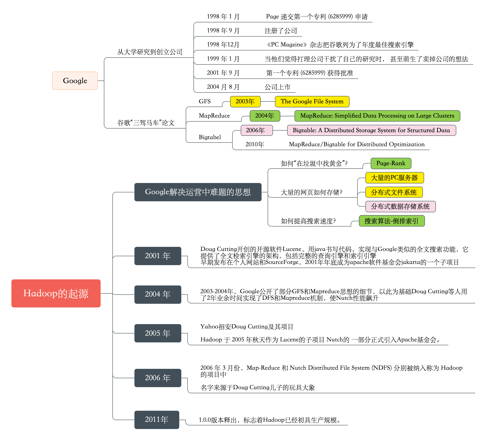
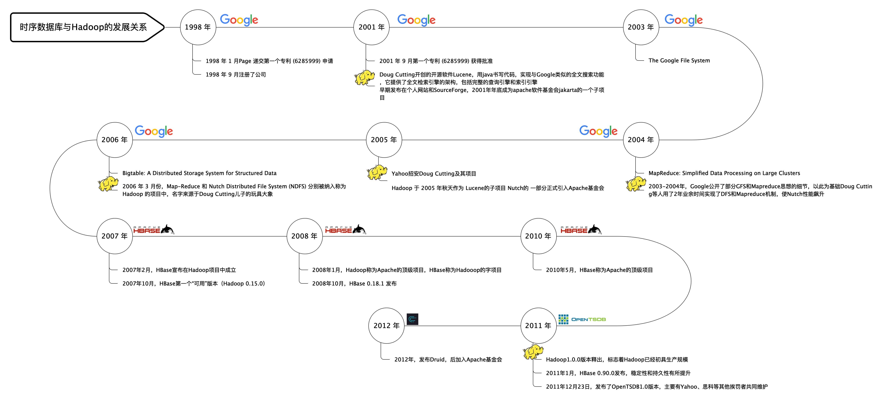

<!-- TOC depthFrom:1 depthTo:6 withLinks:1 updateOnSave:1 orderedList:0 -->

- [OpenTSDB](#opentsdb)
	- [开始之前](#开始之前)
		- [了解Hadoop的起源](#了解hadoop的起源)
		- [阅读Google的相关论文](#阅读google的相关论文)
		- [理解HDFS的原理](#理解hdfs的原理)
		- [理解HBase的原理](#理解hbase的原理)
		- [我的理解](#我的理解)
	- [HBase初体验](#hbase初体验)
	- [OpenTSDB初体验](#opentsdb初体验)
		- [1.  安装Hbase](#1-安装hbase)
		- [2. 下载opentsdb](#2-下载opentsdb)
		- [3. 安装opentsdb](#3-安装opentsdb)
		- [4. Hbase中执行初始化脚本](#4-hbase中执行初始化脚本)
		- [5. 修改配置文件`/etc/opentsdb/opentsdb.conf`](#5-修改配置文件etcopentsdbopentsdbconf)
		- [6. 启动tsd:](#6-启动tsd)
		- [7. 访问TSD的网页](#7-访问tsd的网页)
		- [8. 安装tcollector](#8-安装tcollector)
		- [9. 修改opentsdb配置文件自动创建uid的功能](#9-修改opentsdb配置文件自动创建uid的功能)
		- [10. 重新启动tsd](#10-重新启动tsd)
		- [11. 启动tcollector](#11-启动tcollector)
		- [12. 使用OpenTSDB的UI查询`iostat.disk.await`](#12-使用opentsdb的ui查询iostatdiskawait)
		- [13. 进入HBase查看OpenTSDB创建的表明细](#13-进入hbase查看opentsdb创建的表明细)
		- [14. 关闭测试环境](#14-关闭测试环境)
	- [Bash脚本自动安装hbase_opentsdb_tcollector](#bash脚本自动安装hbaseopentsdbtcollector)
	- [OpenTSDB(HBase)时序数据存储模型](#opentsdbhbase时序数据存储模型)
		- [时序数据基本概念](#时序数据基本概念)
			- [datasource(tag)](#datasourcetag)
			- [metric](#metric)
			- [timestamp](#timestamp)
			- [时序数据表举例](#时序数据表举例)
		- [底层存储模型](#底层存储模型)
			- [RowKey规则](#rowkey规则)
			- [OpenTSDB存储设计的问题](#opentsdb存储设计的问题)
				- [问题一：存在很多无用的字段](#问题一存在很多无用的字段)
				- [问题二：数据源和采集指标冗余](#问题二数据源和采集指标冗余)
				- [问题三：无法有效的压缩](#问题三无法有效的压缩)
				- [问题四：不能完全保证多维查询能力](#问题四不能完全保证多维查询能力)
			- [OpenTSDB对存储模型的优化](#opentsdb对存储模型的优化)
				- [优化一_时间戳优化](#优化一时间戳优化)
				- [优化二_全局编码](#优化二全局编码)
	- [OpenTSDB体系结构](#opentsdb体系结构)

<!-- /TOC -->
# OpenTSDB

[OpenTSDB docs](http://opentsdb.net/docs/build/html/index.html)

## 开始之前

OpenTSDB 是可扩展的分布式时序数据库，底层依赖 HBase。作为基于通用存储开发的时序数据库典型代表，起步比较早，在时序市场的认可度相对较高。

要深入理解 OpenTSDB，需要先了解 HBase ，而 Apache HBase™是 Hadoop 数据库，是一个分布式，可扩展的大数据存储，模仿了Google的Bigtable。

正如Bigtable利用Google文件系统提供的分布式数据存储一样，Apache HBase在Hadoop和HDFS之上提供类似Bigtable的功能。

从上述关系中，我们可以梳理出以下关键字：

* Google
* Hadoop
* BigTable
* HBase


因此在学习OpenTSDB之前，需要先将以上关键字理解清楚。


### 了解Hadoop的起源

[Hadoop的起源](https://github.com/BoobooWei/booboo_hadoop/blob/master/01_theory/01_Introduction%20to%20the%20origin%20and%20system%20of%20hadoop.md)



从Google、Hadoop、TSDB这三条时间线中，不难发现时序数据库与他们之间的关系。




### 阅读Google的相关论文

- [2003@ai.google@The Google File System](https://ai.google/research/pubs/pub51)
- [2004@www.usenix.org@MapReduce: Simplified Data Processing on Large Clusters](https://www.usenix.org/legacy/events/osdi04/tech/full_papers/dean/dean.pdf)--
- [2004@ai.google@MapReduce: Simplified Data Processing on Large Clusters](https://ai.google/research/pubs/pub62)
- [2006@www.usenix.org@Bigtable: A Distributed Storage System for Structured Data](https://www.usenix.org/legacy/event/osdi06/tech/chang/chang_html/index.html)
- [2010@ai.google@MapReduce/Bigtable for Distributed Optimization](https://ai.google/research/pubs/pub36948)

国内中文翻译参考：

* [Google-GFS 中文](https://github.com/BoobooWei/booboo_hadoop/blob/master/hadoop_pdf/Google/Google-File-System%E4%B8%AD%E6%96%87%E7%89%88_1.0.pdf)
* [Google-MapReduce 中文](https://github.com/BoobooWei/booboo_hadoop/blob/master/hadoop_pdf/Google/Google-MapReduce%E4%B8%AD%E6%96%87%E7%89%88_1.0.pdf)
* [Google-Bigtable 中文](https://github.com/BoobooWei/booboo_hadoop/blob/master/hadoop_pdf/Google/Google-Bigtable%E4%B8%AD%E6%96%87%E7%89%88_1.0.pdf)

### 理解HDFS的原理

[HDFS的原理](http://hadoop.apache.org/)

### 理解HBase的原理

[HBase的原理](https://hbase.apache.org/)

### 我的理解

此处没有必要去将每一个技术都深入学习，在阅读文献的基础上，能够理解这些技术应用的场景和实现原理即可。因为理解这些技术的目的是为了学习时序数据库。

下图是我个人对HDFS、HBase从底层文件角度的关系理解：


## HBase初体验

[hbase-2.1.4安装和使用](https://github.com/BoobooWei/booboo_hadoop/blob/master/02_operation/hbaseInstall.md)

## OpenTSDB初体验

### 1.  安装Hbase

```shell
[root@db install]# cat /etc/redhat-release
CentOS release 6.9 (Final)
[root@db hbase-2.1.4]# bin/start-hbase.sh
running master, logging to /alidata/install/hbase-2.1.4/bin/../logs/hbase-root-master-db.out
[root@db hbase-2.1.4]# ss -luntp|grep 2181
tcp    LISTEN     0      50                     *:2181                  *:*      users:(("java",31273,182))
```

### 2. 下载opentsdb

[OpenTSDB Github下载地址](https://github.com/OpenTSDB/opentsdb/releases)

```shell
[root@db install]# wget https://github.com/OpenTSDB/opentsdb/releases/download/v2.4.0/opentsdb-2.4.0.noarch.rpm
```

### 3. 安装opentsdb

```shell
[root@db install]# yum localinstall -y opentsdb-2.4.0.noarch.rpm
已安装:
  opentsdb.noarch 0:2.4.0-1

作为依赖被安装:
  gd.x86_64 0:2.0.35-11.el6           gnuplot.x86_64 0:4.2.6-2.el6        gnuplot-common.x86_64 0:4.2.6-2.el6
  libXpm.x86_64 0:3.5.10-2.el6

完毕！
[root@db install]# rpm -ql opentsdb
/usr/bin/tsdb
/usr/share/opentsdb
/usr/share/opentsdb/bin
/usr/share/opentsdb/bin/mygnuplot.bat
/usr/share/opentsdb/bin/mygnuplot.sh
/usr/share/opentsdb/bin/tsdb
/usr/share/opentsdb/etc
/usr/share/opentsdb/etc/init.d
/usr/share/opentsdb/etc/init.d/opentsdb
/usr/share/opentsdb/etc/opentsdb
/usr/share/opentsdb/etc/opentsdb/logback.xml
/usr/share/opentsdb/etc/opentsdb/opentsdb.conf
/usr/share/opentsdb/etc/systemd
/usr/share/opentsdb/etc/systemd/system
/usr/share/opentsdb/etc/systemd/system/opentsdb@.service
/usr/share/opentsdb/lib
/usr/share/opentsdb/lib/asm-4.0.jar
/usr/share/opentsdb/lib/async-1.4.0.jar
/usr/share/opentsdb/lib/asynchbase-1.8.2.jar
/usr/share/opentsdb/lib/commons-jexl-2.1.1.jar
/usr/share/opentsdb/lib/commons-logging-1.1.1.jar
/usr/share/opentsdb/lib/commons-math3-3.4.1.jar
/usr/share/opentsdb/lib/guava-18.0.jar
/usr/share/opentsdb/lib/jackson-annotations-2.9.5.jar
/usr/share/opentsdb/lib/jackson-core-2.9.5.jar
/usr/share/opentsdb/lib/jackson-databind-2.9.5.jar
/usr/share/opentsdb/lib/javacc-6.1.2.jar
/usr/share/opentsdb/lib/jgrapht-core-0.9.1.jar
/usr/share/opentsdb/lib/kryo-2.21.1.jar
/usr/share/opentsdb/lib/log4j-over-slf4j-1.7.7.jar
/usr/share/opentsdb/lib/logback-classic-1.0.13.jar
/usr/share/opentsdb/lib/logback-core-1.0.13.jar
/usr/share/opentsdb/lib/minlog-1.2.jar
/usr/share/opentsdb/lib/netty-3.10.6.Final.jar
/usr/share/opentsdb/lib/protobuf-java-2.5.0.jar
/usr/share/opentsdb/lib/reflectasm-1.07-shaded.jar
/usr/share/opentsdb/lib/slf4j-api-1.7.7.jar
/usr/share/opentsdb/lib/tsdb-2.4.0.jar
/usr/share/opentsdb/lib/zookeeper-3.4.6.jar
/usr/share/opentsdb/plugins
/usr/share/opentsdb/static
/usr/share/opentsdb/static/3FE8D2D31B2B8088AB5C3AAA904D7911.cache.html
/usr/share/opentsdb/static/508491AE9B85F1EF694B9D473E6DAD87.cache.html
/usr/share/opentsdb/static/5215AC11CF2E617D244E775B35EDD818.cache.html
/usr/share/opentsdb/static/72EAC0365EDAD7DE09D54C32270D37DC.cache.html
/usr/share/opentsdb/static/9F09E1D7F208BA0E3F5FFF35E4615599.cache.html
/usr/share/opentsdb/static/clear.cache.gif
/usr/share/opentsdb/static/favicon.ico
/usr/share/opentsdb/static/gwt
/usr/share/opentsdb/static/gwt/opentsdb
/usr/share/opentsdb/static/gwt/opentsdb/images
/usr/share/opentsdb/static/gwt/opentsdb/images/corner.png
/usr/share/opentsdb/static/gwt/opentsdb/images/hborder.png
/usr/share/opentsdb/static/gwt/opentsdb/images/ie6
/usr/share/opentsdb/static/gwt/opentsdb/images/ie6/corner_dialog_topleft.png
/usr/share/opentsdb/static/gwt/opentsdb/images/ie6/corner_dialog_topright.png
/usr/share/opentsdb/static/gwt/opentsdb/images/ie6/hborder_blue_shadow.png
/usr/share/opentsdb/static/gwt/opentsdb/images/ie6/hborder_gray_shadow.png
/usr/share/opentsdb/static/gwt/opentsdb/images/ie6/vborder_blue_shadow.png
/usr/share/opentsdb/static/gwt/opentsdb/images/ie6/vborder_gray_shadow.png
/usr/share/opentsdb/static/gwt/opentsdb/images/splitPanelThumb.png
/usr/share/opentsdb/static/gwt/opentsdb/images/vborder.png
/usr/share/opentsdb/static/gwt/opentsdb/opentsdb.css
/usr/share/opentsdb/static/gwt/opentsdb/opentsdb_rtl.css
/usr/share/opentsdb/static/hosted.html
/usr/share/opentsdb/static/opentsdb_header.jpg
/usr/share/opentsdb/static/queryui.nocache.js
/usr/share/opentsdb/tools
/usr/share/opentsdb/tools/check_tsd
/usr/share/opentsdb/tools/clean_cache.sh
/usr/share/opentsdb/tools/create_table.sh
/usr/share/opentsdb/tools/opentsdb_restart.py
/usr/share/opentsdb/tools/tsddrain.py
/usr/share/opentsdb/tools/upgrade_1to2.sh
/var/cache/opentsdb
/var/log/opentsdb
```

 启动服务名`opentsdb`

```
[root@db install]# ll /etc/init.d/opentsdb
lrwxrwxrwx 1 root root 39 5月   3 22:44 /etc/init.d/opentsdb -> /usr/share/opentsdb/etc/init.d/opentsdb
```

### 4. Hbase中执行初始化脚本

```sh l lsh l
[root@db install]# env COMPRESSION=NONE HBASE_HOME=/alidata/install/hbase-2.1.4/ /usr/share/opentsdb/tools/create_table.sh
2019-05-03 23:06:14,454 WARN  [main] util.NativeCodeLoader: Unable to load native-hadoop library for your platform... using builtin-java classes where applicable
HBase Shell
Use "help" to get list of supported commands.
Use "exit" to quit this interactive shell.
For Reference, please visit: http://hbase.apache.org/2.0/book.html#shell
Version 2.1.4, r5b7722f8551bca783adb36a920ca77e417ca99d1, Tue Mar 19 19:05:06 UTC 2019
Took 0.0052 seconds
create 'tsdb-uid',
  {NAME => 'id', COMPRESSION => 'NONE', BLOOMFILTER => 'ROW', DATA_BLOCK_ENCODING => 'DIFF'},
  {NAME => 'name', COMPRESSION => 'NONE', BLOOMFILTER => 'ROW', DATA_BLOCK_ENCODING => 'DIFF'}
Created table tsdb-uid
Took 1.3271 seconds
Hbase::Table - tsdb-uid

create 'tsdb',
  {NAME => 't', VERSIONS => 1, COMPRESSION => 'NONE', BLOOMFILTER => 'ROW', DATA_BLOCK_ENCODING => 'DIFF', TTL => 'FOREVER'}
Created table tsdb
Took 0.7314 seconds
Hbase::Table - tsdb

create 'tsdb-tree',
  {NAME => 't', VERSIONS => 1, COMPRESSION => 'NONE', BLOOMFILTER => 'ROW', DATA_BLOCK_ENCODING => 'DIFF'}
Created table tsdb-tree
Took 0.7351 seconds
Hbase::Table - tsdb-tree

create 'tsdb-meta',
  {NAME => 'name', COMPRESSION => 'NONE', BLOOMFILTER => 'ROW', DATA_BLOCK_ENCODING => 'DIFF'}
Created table tsdb-meta
Took 0.7300 seconds
Hbase::Table - tsdb-meta

```

该脚本会新建四个表：`tsdb`, `tsdb-uid`, `tsdb-tree` 和 `tsdb-meta`。

### 5. 修改配置文件`/etc/opentsdb/opentsdb.conf`

```shell
[root@db install]# grep -v '^#\|^$' /etc/opentsdb/opentsdb.conf
tsd.network.port = 4242
tsd.http.staticroot = /usr/share/opentsdb/static/
tsd.http.cachedir = /tmp/opentsdb
tsd.core.plugin_path = /usr/share/opentsdb/plugins
```

### 6. 启动tsd:

```shell
tsdb tsd

[root@db ~]# ss -luntp|grep 4242
tcp    LISTEN     0      50                     *:4242                  *:*      users:(("java",732,60))
[root@db ~]# ps -ef|grep tsd
root       732 31176  0 23:12 pts/0    00:00:04 java -enableassertions -enablesystemassertions -classpath /usr/share/opentsdb/*.jar:/usr/share/opentsdb:/usr/share/opentsdb/bin:/usr/share/opentsdb/lib/asm-4.0.jar:/usr/share/opentsdb/lib/async-1.4.0.jar:/usr/share/opentsdb/lib/asynchbase-1.8.2.jar:/usr/share/opentsdb/lib/commons-jexl-2.1.1.jar:/usr/share/opentsdb/lib/commons-logging-1.1.1.jar:/usr/share/opentsdb/lib/commons-math3-3.4.1.jar:/usr/share/opentsdb/lib/guava-18.0.jar:/usr/share/opentsdb/lib/jackson-annotations-2.9.5.jar:/usr/share/opentsdb/lib/jackson-core-2.9.5.jar:/usr/share/opentsdb/lib/jackson-databind-2.9.5.jar:/usr/share/opentsdb/lib/javacc-6.1.2.jar:/usr/share/opentsdb/lib/jgrapht-core-0.9.1.jar:/usr/share/opentsdb/lib/kryo-2.21.1.jar:/usr/share/opentsdb/lib/log4j-over-slf4j-1.7.7.jar:/usr/share/opentsdb/lib/logback-classic-1.0.13.jar:/usr/share/opentsdb/lib/logback-core-1.0.13.jar:/usr/share/opentsdb/lib/minlog-1.2.jar:/usr/share/opentsdb/lib/netty-3.10.6.Final.jar:/usr/share/opentsdb/lib/protobuf-java-2.5.0.jar:/usr/share/opentsdb/lib/reflectasm-1.07-shaded.jar:/usr/share/opentsdb/lib/slf4j-api-1.7.7.jar:/usr/share/opentsdb/lib/tsdb-2.4.0.jar:/usr/share/opentsdb/lib/zookeeper-3.4.6.jar:/etc/opentsdb net.opentsdb.tools.TSDMain
```

### 7. 访问TSD的网页

访问 [http://127.0.0.1:4242](http://127.0.0.1:4242/)


### 8. 安装tcollector

```shell
[root@db install]# git clone https://github.com/OpenTSDB/tcollector.git
[root@db install]# cd tcollector/
[root@db tcollector]# ls
AUTHORS       COPYING         eos        rpm          tcollector.py
CHANGELOG.md  COPYING.LESSER  mocks.py   stumbleupon  tests.py
collectors    debian          README.md  tcollector   THANKS
```

### 9. 修改opentsdb配置文件自动创建uid的功能

`tsd.core.auto_create_metrics = true `

具体操作如下：

```shell
[root@db tcollector]# vim /etc/opentsdb/opentsdb.conf
[root@db tcollector]# grep -v '^#\|^$' /etc/opentsdb/opentsdb.conf
tsd.network.port = 4242
tsd.http.staticroot = /usr/share/opentsdb/static/
tsd.http.cachedir = /tmp/opentsdb
tsd.core.auto_create_metrics = true
tsd.core.plugin_path = /usr/share/opentsdb/plugins
```

### 10. 重新启动tsd

```shell
[root@db tcollector]# kill -9 31176
[root@db tcollector]# ps -ef|grep open
root      1890  1671  0 23:50 pts/7    00:00:00 grep open
[root@db tcollector]# tsdb tsd
```

### 11. 启动tcollector

```shell
[root@db tcollector]# ll /alidata/install/tcollector/tcollector
-rwxr-xr-x 1 root root 2554 5月   3 23:37 /alidata/install/tcollector/tcollector
[root@db tcollector]# /alidata/install/tcollector/tcollector start -H localhost -p 4242
Starting /alidata/install/tcollector/tcollector.py
[root@db tcollector]# tailf /var/log/tcollector.log
2019-05-03 23:53:28,275 tcollector[2052] WARNING: collector zabbix_bridge_cache.py terminated after 16 seconds with status code 1, marking dead
2019-05-03 23:53:28,275 tcollector[2052] INFO: removing postgresql.py from the list of collectors (by request)
2019-05-03 23:53:28,275 tcollector[2052] WARNING: collector zabbix_bridge.py terminated after 16 seconds with status code 1, marking dead
2019-05-03 23:53:28,275 tcollector[2052] INFO: removing riak.py from the list of collectors (by request)
2019-05-03 23:53:28,275 tcollector[2052] INFO: removing redis_stats.py from the list of collectors (by request)
2019-05-03 23:53:28,275 tcollector[2052] INFO: removing zookeeper.py from the list of collectors (by request)
2019-05-03 23:53:28,275 tcollector[2052] INFO: removing opentsdb.sh from the list of collectors (by request)
2019-05-03 23:53:28,275 tcollector[2052] WARNING: collector tcollector.py terminated after 15 seconds with status code 1, marking dead
2019-05-03 23:53:28,276 tcollector[2052] INFO: removing jolokia.py from the list of collectors (by request)
2019-05-03 23:53:28,276 tcollector[2052] INFO: removing postgresql_replication.py from the list of collectors (by request)
[root@db tcollector]# ps -ef|grep tcoll
root      2051     1  0 23:53 pts/0    00:00:00 /bin/sh /alidata/install/tcollector/tcollector start -H localhost -p 4242
root      2052  2051  0 23:53 pts/0    00:00:00 /usr/bin/python2.6 /alidata/install/tcollector/tcollector.py -H localhost -p 4242
nobody    2057  2052  0 23:53 ?        00:00:00 python /alidata/install/tcollector/collectors/0/hbase_master.py
nobody    2060  2052  0 23:53 ?        00:00:00 python /alidata/install/tcollector/collectors/0/udp_bridge.py
nobody    2067  2052  0 23:53 ?        00:00:00 python /alidata/install/tcollector/collectors/0/procstats.py
nobody    2074  2052  0 23:53 ?        00:00:00 python /alidata/install/tcollector/collectors/0/procnettcp.py
nobody    2076  2052  0 23:53 ?        00:00:00 python /alidata/install/tcollector/collectors/0/tcp_bridge.py
root      2078  2052  0 23:53 ?        00:00:00 python /alidata/install/tcollector/collectors/0/sysload.py
nobody    2089  2052  0 23:53 ?        00:00:00 python /alidata/install/tcollector/collectors/0/hadoop_yarn_node_manager.py
nobody    2102  2052  0 23:53 ?        00:00:00 python /alidata/install/tcollector/collectors/0/hadoop_namenode.py
nobody    2110  2052  0 23:53 ?        00:00:00 python /alidata/install/tcollector/collectors/0/hadoop_yarn_resource_manager.py
nobody    2116  2052  0 23:53 ?        00:00:00 python /alidata/install/tcollector/collectors/0/ifstat.py
nobody    2122  2052  0 23:53 ?        00:00:00 python /alidata/install/tcollector/collectors/0/hbase_regionserver.py
nobody    2124  2052  0 23:53 ?        00:00:00 python /alidata/install/tcollector/collectors/0/iostat.py
nobody    2126  2052  0 23:53 ?        00:00:00 python /alidata/install/tcollector/collectors/0/netstat.py
nobody    2132  2052  0 23:53 ?        00:00:00 python /alidata/install/tcollector/collectors/0/ntpstat.py
nobody    2133  2052  0 23:53 ?        00:00:00 python /alidata/install/tcollector/collectors/0/dfstat.py
nobody    2141  2052  0 23:53 ?        00:00:00 python /alidata/install/tcollector/collectors/0/hadoop_datanode.py
root      2146  2052  0 23:53 ?        00:00:00 python /alidata/install/tcollector/collectors/0/mountstats.py
```

### 12. 使用OpenTSDB的UI查询`iostat.disk.await`


### 13. 进入HBase查看OpenTSDB创建的表明细

```bash
[root@db hbase-2.1.4]# pwd
/alidata/install/hbase-2.1.4
[root@db hbase-2.1.4]# bin/hbase shell
2019-05-04 00:11:33,679 WARN  [main] util.NativeCodeLoader: Unable to load native-hadoop library for your platform... using builtin-java classes where applicable
HBase Shell
Use "help" to get list of supported commands.
Use "exit" to quit this interactive shell.
For Reference, please visit: http://hbase.apache.org/2.0/book.html#shell
Version 2.1.4, r5b7722f8551bca783adb36a920ca77e417ca99d1, Tue Mar 19 19:05:06 UTC 2019
Took 0.0040 seconds
hbase(main):014:0> list_namespace_tables 'default'
TABLE
tsdb
tsdb-meta
tsdb-tree
tsdb-uid
4 row(s)
Took 0.0107 seconds
=> ["tsdb", "tsdb-meta", "tsdb-tree", "tsdb-uid"]

hbase(main):001:0> list
TABLE
tsdb
tsdb-meta
tsdb-tree
tsdb-uid
4 row(s)
Took 0.5340 seconds
=> ["tsdb", "tsdb-meta", "tsdb-tree", "tsdb-uid"]
```

* Hbase::Table - tsdb-uid::**存储name和uid的映射关系**
* Hbase::Table - tsdb::**存储数据点**
* Hbase::Table - tsdb-tree::**树形表**
* Hbase::Table - tsdb-meta::**元数据表**

具体解析[参考文章](https://www.jianshu.com/p/b7e3a33c71e9)

### 14. 关闭测试环境

```
[root@db ~]# /alidata/install/tcollector/tcollector stop
[root@db ~]# ps -ef|grep tsd
root      1899  1671  0 May03 pts/7    00:00:16 java -enableassertions -enablesystemassertions -classpath /usr/share/opentsdb/*.jar:/usr/share/opentsdb:/usr/share/opentsdb/bin:/usr/share/opentsdb/lib/asm-4.0.jar:/usr/share/opentsdb/lib/async-1.4.0.jar:/usr/share/opentsdb/lib/asynchbase-1.8.2.jar:/usr/share/opentsdb/lib/commons-jexl-2.1.1.jar:/usr/share/opentsdb/lib/commons-logging-1.1.1.jar:/usr/share/opentsdb/lib/commons-math3-3.4.1.jar:/usr/share/opentsdb/lib/guava-18.0.jar:/usr/share/opentsdb/lib/jackson-annotations-2.9.5.jar:/usr/share/opentsdb/lib/jackson-core-2.9.5.jar:/usr/share/opentsdb/lib/jackson-databind-2.9.5.jar:/usr/share/opentsdb/lib/javacc-6.1.2.jar:/usr/share/opentsdb/lib/jgrapht-core-0.9.1.jar:/usr/share/opentsdb/lib/kryo-2.21.1.jar:/usr/share/opentsdb/lib/log4j-over-slf4j-1.7.7.jar:/usr/share/opentsdb/lib/logback-classic-1.0.13.jar:/usr/share/opentsdb/lib/logback-core-1.0.13.jar:/usr/share/opentsdb/lib/minlog-1.2.jar:/usr/share/opentsdb/lib/netty-3.10.6.Final.jar:/usr/share/opentsdb/lib/protobuf-java-2.5.0.jar:/usr/share/opentsdb/lib/reflectasm-1.07-shaded.jar:/usr/share/opentsdb/lib/slf4j-api-1.7.7.jar:/usr/share/opentsdb/lib/tsdb-2.4.0.jar:/usr/share/opentsdb/lib/zookeeper-3.4.6.jar:/etc/opentsdb net.opentsdb.tools.TSDMain
root      4216  4196  0 00:19 pts/10   00:00:00 grep tsd
[root@db ~]# kill -9 1899
[root@db ~]# /alidata/install/hbase-2.1.4/bin/stop-hbase.sh
stopping hbase...........
```

## Bash脚本自动安装hbase_opentsdb_tcollector

[Bash脚本自动安装链接](../scripts/auto_install_hbase_opentsdb_tcollector.sh)

## OpenTSDB(HBase)时序数据存储模型

### 时序数据基本概念

[Data Specification doc](http://opentsdb.net/docs/build/html/user_guide/writing/index.html)

* **逻辑**：一个时序数据点（point）由`datasource(tags)`+`metric`+`timestamp`这三部分唯一确定
* **物理**：不同的时序数据库有不同的存储方法

#### datasource(tag)

数据源由一系列的标签（tag，也称为维度）唯一表示;

**datasource举例说明**

例如数据源是一个“服务器数据源”，这个数据源由

* RegionId 地域
* HostName 主机名
* IpAddress ip地址

三个维度值唯一表示。

|RegionId|HostName|cpu|
|:--|:--|:--|
|cn-shanghai|web-01|cpu-total|
|cn-shanghai|web-01|cpu-0|
|cn-shanghai|web-01|cpu-1|
|cn-shanghai|web-02|cpu-total|
|cn-shanghai|web-02|cpu-0|
|cn-shanghai|web-02|cpu-1|
|cn-hangzhou|web-03|cpu-total|
|cn-hangzhou|web-03|cpu-0|
|cn-hangzhou|web-03|cpu-1|
|cn-hangzhou|web-04|cpu-total|
|cn-hangzhou|web-04|cpu-0|
|cn-hangzhou|web-04|cpu-1|

OpenTSDB的tag限制:

```shell
1. 最多为8个;
2. 不允许有空格;
3. 只有允许使用以下字符：a到z，A到Z，0到9，-，_，.，/或Unicode字母（按照规范）
4. 标签的长度不受限制，但应该尽量保持这些值非常短。
```

**思考题-为什么时序数据库要限制tag的数量呢？**

根据表中的tag，我们来计算一下`series cardinality`序列基数：

`ReginIds` * `HostNames` * `IpAddress` = `series cardinality`

$$
2 * 4 * 3 = 24
$$

包含高度可变信息（如UUID，哈希值和随机字符串）的标签将导致数据库中出现大量序列，通俗地称为**高系列基数**。高系列基数是许多数据库工作负载的高内存使用率的主要原因之一。


#### metric

指标名称 例如关系型数据中的表
例如：sys.cpu.user

#### timestamp

支持人类可读的绝对时间戳或Unix风格的整型格式。相对时间通常用来刷新仪表板。

虽然OpenTSDB可以以毫秒分辨率（精度）存储数据，但大多数查询将以秒级分辨率返回数据，以提供对现有工具的向后兼容性。除非使用指定了降采样算法的查询，否则将使用查询中指定的相同聚合函数将数据自动降采样到1秒。这样，如果多个数据点存储在一个给定的秒数，它们将被聚合并正确返回一个正常的查询。

#### 时序数据表举例

从逻辑上查看到的数据如下：

|metric|timestamp|value|tag|||
|:--|:--|:--|:--|:--|:--|
|指标名|时间戳|值|地域|主机名|cpu编号|
|sys.cpu.user|1557142276|88.76|cn-shanghai|web-01|cpu-total|
|sys.cpu.user|1557142276|88.76|cn-shanghai|web-01|cpu-0|
|sys.cpu.user|1557142276|88.76|cn-shanghai|web-01|cpu-1|

思考：物理上又是如何存储的呢？

### 底层存储模型

#### RowKey规则

OpenTSDB基于HBase存储时序数据，在HBase层面设计 RowKey 规则为：

`metric+timestamp+datasource(tags)`

HBase是一个KV数据库，一个时序数据(point)如果以KV的形式表示，那么其中的`V`必然是`point`的具体数值，而K就自然而然是唯一确定`point`数值的`datasource+metric+timestamp`;表的数据组织方式是按照RowKey的字典序顺序排列的.

既然HBase中`K`是由`datasource、metric以及timestamp`三者构成，现在我们可以简单认为`RowKey`就为这三者的组合。

```json
{
	"region=cn-shanghai&hostname:web-01&cpu:cpu-0_sys.cpu.user_1557142276" : 88.67,
	"region=cn-shanghai&hostname:web-01&cpu:cpu-0_sys.cpu.user_1557142278" : 87,22
}
```
**思考：这三者的组合顺序是怎么样的呢？**

> 1. 首先来看哪个应该排在首位?

为了将**同一种指标**的所有数据集中放在一起，HBase将metric放在了rowkey的最前面。

- 如果将timestamp放在最前面，同一时刻的数据必然会写入同一个数据分片，无法起到散列的效果；
- 而如果将datasource（即tags）放在最前面的话，这里有个更大的问题，就是datasource本身由多个标签组成，如果用户指定其中部分标签查找，而且不是前缀标签的话，在HBase里面将会变成大范围的扫描过滤查询，查询效率非常之低。

举个上面的例子，如果将datasource放在最前面，那rowkey就可以表示为`region=cn-shanghai&hostname:web-01&cpu:cpu-0_sys.cpu.user_1557142276000`，此时用户想查找`1557142276000`这个时间点`cpu`为`cpu-01`的所有`sys.cpu.user`的值，即只根据`cpu=cpu-01`这样一个维度信息查找指定时间点的某个指标，而且这个维度不是前缀维度，就会扫描大量的记录进行过滤。

> 2. 确定了metric放在最前面之后，再来看看接下来应该将datasource放在中间呢还是应该将timestamp放在中间？

将metric放在前面已经可以解决请求均匀分布（散列）的要求，因此HBase将timestamp放在中间，将datasource放在最后。

- 试想，如果将datasource放在中间，也会遇到上文中说到的后缀维度查找的问题。

因此，OpenTSDB中 RowKey 的设计为：`metric+timestamp+datasource`，在HBase中只需要设置一个columnfamily和一个column。

```sql
create 'tsdb',
  {NAME => 't', VERSIONS => 1, COMPRESSION => 'NONE', BLOOMFILTER => 'ROW', DATA_BLOCK_ENCODING => 'DIFF', TTL => 'FOREVER'}
put 'tsdb', RowKey, 't:[子列]', value
```

现在再来看这张tsdb表，只有一个列族为`t`。

> 问题：子列是怎么定义的呢？

子列名 = 时间戳-将小时截取时间戳之后的秒数

#### OpenTSDB存储设计的问题

OpenTSDB的这种设计有什么问题呢？在了解设计问题之前需要简单看看HBase在文件中存储KV的方式，即一系列时序数据在文件、内存中的存储方式，如下图所示：


从途中可以看到一个KeyValue的数据结构由以下四个部分组成：

|key length|value length|key|value|
|:--|:--|:--|:--|
|key长度|value长度|key明细|value值|

key的数据结构由以下7个部分组成：

|rowkey length|rowkey|columnfamily length|columnFamily|columnQualifier|TimeStamp|KeyType|
|:--|:--|:--|:--|:--|:--|:--|
|rowkey长度|rowkey值|列族长度|列族值|子列值|时间戳|key类型|


##### 问题一：存在很多无用的字段

一个`Key`的数据结构中只有`rowkey length`和`rowkey`是有用的，其他字段诸如`columnfamily`、`column`、`timestamp`以及`keytype`从理论上来讲都没有任何实际意义，但在HBase的存储体系里都必须存在，因而耗费了很大的存储成本。


##### 问题二：数据源和采集指标冗余

`Key`数据结构中的`rowkey`等于`metric+timestamp+datasource`，试想同一个数据源的同一个采集指标，随着时间的流逝不断吐出采集数据，这些数据理论上共用同一个数据源(datasource)和采集指标(metric)，但在HBase的这套存储体系下，共用是无法体现的，因此存在大量的数据冗余，主要是数据源冗余以及采集指标冗余。

```json
{
	"region=cn-shanghai&hostname:web-01&cpu:cpu-0_sys.cpu.user_1557142276" : 88.67,
	"region=cn-shanghai&hostname:web-01&cpu:cpu-0_sys.cpu.user_1557142277" : 87.22,
	"region=cn-shanghai&hostname:web-01&cpu:cpu-0_sys.cpu.user_1557142278" : 87.21,
	此处神略...1万行
}
```


##### 问题三：无法有效的压缩

HBase提供了块级别的压缩算法－snappy、gzip等，这些通用压缩算法并没有针对时序数据进行设置，压缩效率比较低。HBase同样提供了一些编码算法，比如FastDiff等等，可以起到一定的压缩效果，但是效果并不佳。效果不佳的主要原因是HBase没有数据类型的概念，没有schema的概念，不能针对特定数据类型进行特定编码，只能选择通用的编码，效果可想而知。


##### 问题四：不能完全保证多维查询能力

HBase本身没有schema，目前没有实现倒排索引机制，所有查询必须指定metric、timestamp以及完整的tags或者前缀tags进行查询，对于后缀维度查询也勉为其难。


#### OpenTSDB对存储模型的优化


##### 优化一_时间戳优化

timestamp并不是想象中细粒度到秒级或毫秒级，而是精确到小时级别，然后将小时中每一秒设置到列上。这样一行就会有3600列，每一列表示一小时的一秒。这样设置据说可以有效的取出一小时整的数据。

1. 1557142276 是 北京时间 2019/5/6 19:31:16；
2. 截取到小时为北京时间 2019/5/6 19:00:00
3. 转换为时间戳为 1557140400
4. 1557142276 - 1557140400 = 2276

子列名 = 时间戳-将小时截取时间戳之后的秒数

##### 优化二_全局编码

所有metrics以及所有标签信息（tags）都使用了全局编码将标签值编码成更短的bit，减少rowkey的存储数据量。上文分析HBase这种存储方式的弊端是说道会存在大量的数据源(tags)冗余以及指标(metric)冗余，有冗余是吧，那我就搞个编码，将string编码成bit，尽最大努力减少冗余。虽说这样的全局编码可以有效降低数据的存储量，但是因为全局编码字典需要存储在内存中，因此在很多时候（海量标签值），字典所需内存都会非常之大。

上述两个优化可以参考OpenTSDB这张经典的示意图：


|优化过程|key|value|
|:--|:--|:--|
|原始数据|"region=cn-shanghai&hostname:web-01&cpu:cpu-0_sys.cpu.user_1557142276000" |88.67|
|全局编码|0000015BE835E0000001000001000002000003|88.67|
|时间戳优化|0000015BE835E0000001000001000002000003|2276:88.67|


## OpenTSDB体系结构


* 使用hbase作为存储中心，它无须采样，可以完整的收集和存储上亿的数据点，支持秒级别的数据监控，得益于hbase的分布式列式存储，hbase可以灵活的支持metrics的增加，可以支持上万机器和上亿数据点的采集。
* TSD是hbase对外通信的daemon程序，没有master/slave之分，也没有共享状态，因此利用这点和hbase集群的特点就可以消除单点。用户可以通过telnet或者http协议直接访问TSD接口，也可以通过rpc访问TSD。
* 每一个需要获取metrics的Servers都需要设置一个Collector用来收集时间序列数据。这个Collector就是你收集数据的脚本。
