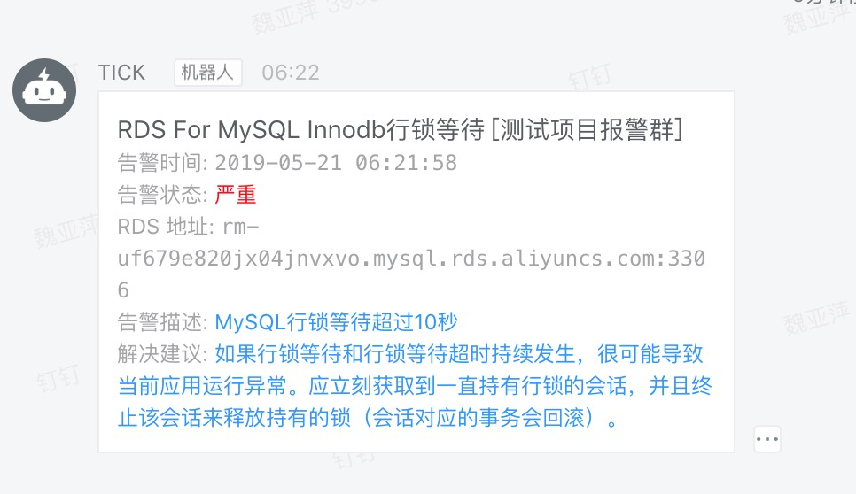

[TOC]

# 07_TPAD 技术栈实现对RDS_For_MySQL监控指标搜集和告警

> TPAD 技术栈实现对RDS_For_MySQL监控指标搜集和告警

## 架构图


## Demo效果图

 

## 步骤概览

1. 开发 Telegraf Inputs 拓展指标
2. 软件安装
3. 软件配置
   * Telegraf Inputs 配置
   * Telegraf Outputs 配置
   * Prometheus Rules 配置
   * Alertmanage receivers 配置
4. 开发接口
5. 测试告警

## 详细过程

### 1. 开发 Telegraf Inputs 拓展指标

* [mysql.go拓展指标说明](https://gitlab.jiagouyun.com/DataProduct/zy_telegraf/blob/master/info/mysql.md)

* [mysql.go拓展指标源码](https://gitlab.jiagouyun.com/DataProduct/zy_telegraf/blob/master/src/mysql.go)
* [telegraf 多平台交叉编译](https://github.com/influxdata/telegraf/blob/master/Makefile)

```bash
export all_proxy=socks5://127.0.0.1:1086
export http_proxy=socks5://127.0.0.1:1086
export https_proxy=socks5://127.0.0.1:1086
MacBook-Pro-4:~ booboo$ cd ~/go/src/github.com/influxdata/telegraf/
MacBook-Pro-4:telegraf booboo$ rm -rf ./build/
MacBook-Pro-4:telegraf booboo$ dep ensure -vendor-only
MacBook-Pro-4:telegraf booboo$ ./scripts/build.py --package --platform=all --arch=all
MacBook-Pro-4:telegraf booboo$ ll build/linux/amd64/
total 128112
-rwxr-xr-x  1 booboo  staff  64705152  5 21 03:58 telegraf
```

将编译好的Linux amd64的可执行文件复制到 待采集数据的测试环境中。

```bash
scp telegraf root@115.159.156.200:~/zy_telegraf
```

### 2. 软件安装

具体步骤忽略，软件安装完毕后，软件结构如下（其中influxdb直接使用阿里云TSDB For InfluxDB，也可自建，此处未罗列）：

#### Telegraf

| 软件名         | zy_telegraf                                                  |
| -------------- | ------------------------------------------------------------ |
| 版本           | 在官方1.10基础上二次开发新增mysql相关metric                  |
| 守护进程daemon | `/root/zy_telegraf`                                          |
| 主配置文件     | `/opt/telegraf/etc/telegraf/telegraf.conf`                   |
| 拓展配置文件   | `/opt/telegraf/etc/telegraf/telegraf.d/*.conf`               |
| 日志文件       | `/root/zy_telegraf.log`                                      |
| 服务启动命令   | `/root/zy_telegraf --config /opt/telegraf/etc/telegraf/telegraf.conf --config-directory /opt/telegraf/etc/telegraf/telegraf.d/ &>/root/zy_telegraf.log &` |

#### Prometheus

| 软件名         | Prometheus                                                   |
| -------------- | ------------------------------------------------------------ |
| 版本           | `prometheus-2.7.1`                                           |
| 守护进程daemon | `/usr/local/prometheus-2.7.1/prometheus`                     |
| 主配置文件     | `/usr/local/prometheus-2.7.1/prometheus.yml`                 |
| Rules配置文件  | `/usr/local/prometheus-2.7.1/rules/*.yml`                    |
| 日志文件       | `/usr/local/prometheus-2.7.1/prometheus.log`                 |
| 服务启动命令   | `/usr/local/prometheus-2.7.1/prometheus --web.enable-lifecycle --config.file=/usr/local/prometheus-2.7.1/prometheus.yml &> /usr/local/prometheus-2.7.1/prometheus.log &` |


#### AlertManager

| 软件名         | AlertManager                                                 |
| -------------- | ------------------------------------------------------------ |
| 版本           | `alertmanager-0.16.1`                                        |
| 守护进程daemon | `/usr/local/alertmanager-0.16.1/alertmanager`                |
| 主配置文件     | `/usr/local/alertmanager-0.16.1/alertmanager.yml`            |
| 日志文件       | `/usr/local/alertmanager-0.16.1/alertmanager.log`            |
| 服务启动命令   | `/usr/local/alertmanager-0.16.1/alertmanager --config.file=/usr/local/alertmanager-0.16.1/alertmanager.yml &> /usr/local/alertmanager-0.16.1/alertmanager.log &` |

### 3. 软件配置

#### Telegraf Inputs 配置

```bash
[root@ForeThought-M1 telegraf.d]# cat >> mysql_t.conf << ENDF
[[inputs.mysql]]
  servers = ["prom:xxx@tcp(rm-xxx.mysql.rds.aliyuncs.com:3306)/?tls=false"]
  metric_version = 2
  perf_events_statements_digest_text_limit  = 120
  perf_events_statements_limit              = 250
  perf_events_statements_time_limit         = 86400
  table_schema_databases                    = []
  gather_table_schema                       = false
  gather_process_list                       = true
  gather_user_statistics                    = true
  gather_info_schema_auto_inc               = true
  gather_innodb_metrics                     = true
  gather_slave_status                       = true
  gather_binary_logs                        = false
  gather_table_io_waits                     = false
  gather_table_lock_waits                   = false
  gather_index_io_waits                     = false
  gather_event_waits                        = false
  gather_file_events_stats                  = false
  gather_perf_events_statements             = false
  interval_slow                   = "30m"
ENDF
```


####Telegraf Outputs 配置

```shell
[root@ForeThought-M1 telegraf]# cat >> telegraf.conf << ENDF
[agent]
  interval = "10s"
  round_interval = true
  metric_batch_size = 1000
  metric_buffer_limit = 10000
  collection_jitter = "0s"
  flush_interval = "10s"
  flush_jitter = "0s"
  precision = ""
  debug = false
  quiet = false
  logfile = ""
  hostname = ""
  omit_hostname = false
[[outputs.influxdb]]
  urls = ["https://ts-bxxxx.influxdata.rds.aliyuncs.com:3242"]
  database = "telegraf"
  skip_database_creation = true
  username = "telegraf"
  password = "xxxx"
[[outputs.prometheus_client]]
  listen = ":9273"
ENDF  
```

####Prometheus Rules 配置

```bash
[root@ForeThought-M1 rules]# vim rds_for_mysql_t_rule.yml 
groups:
- name: rds_for_mysql_rule
  rules:
  - alert: "RDS For MySQL Innodb行锁等待"
    expr: mysql_innodb_locks_counts_time > 10
    for: 5s 
    labels:
      severity: average
    annotations:
      description: "MySQL行锁等待超过10秒"
      summary: "如果行锁等待和行锁等待超时持续发生，很可能导致当前应用运行异常。应立刻获取到一直持有行锁的会话，并且终止该会话来释放持有的锁（会话对应的事务会回滚）。"
      value: "{{ $value }}"
  - alert: "RDS For MySQL元锁冲突"
    expr: mysql_metadatalock_count_count > 0
    for: 1m
    labels:
      severity: average
    annotations:
      description: "数据库出现元锁MetaDataLock冲突，已持续1分钟，再持续下去，后果会非常严重！元锁等待后会话将极速堆积，最终导致数据库崩溃。造成元锁的主要原因是：在线执行DDL操作，例如生产环境不停服创建索引命令时，待操作的表存在进行中的操作、存在未提交事务、存在显式事务中的报错语句执行，都会导致数据库元锁MetaDataLock。可以执行以下命令获取待kill的会话:"
      summary: "select concat('kill ',i.trx_mysql_thread_id,';') from information_schema.innodb_trx i,
(select
id, time
from
information_schema.processlist
where
time = (select
max(time)
from
information_schema.processlist
where
state = 'Waiting for table metadata lock'
and substring(info, 1, 5) in ('alter' , 'optim', 'repai', 'lock ', 'drop ', 'creat'))) p
where timestampdiff(second, i.trx_started, now()) > p.time
and i.trx_mysql_thread_id not in (connection_id(),p.id);"
      value: "{{ $value }}"
  - alert: "RDS For MySQL数据库重启"
    expr: (mysql_uptime - mysql_uptime offset 5m) < 0
    for: 1m
    labels:
      severity: average
    annotations:
      description: "RDS For MySQL 数据库被重启"
      summary: "请确认数据库重启是合法操作"
      value: "{{ $value }}"
  - alert: "RDS For MySQL存在大量失败连接"
    expr: mysql_aborted_connects  > mysql_connections * 0.1
    for: 1m
    labels:
      severity: warning
    annotations:
      description: "存在超过10%的失败连接，代表有大量与数据库的中断连接。 造成这种情况的一个常见原因是，由于连接超时到达，应用程序或锁定的表之间的连接被不正确地关闭，导致随后的连接>中断。"
      summary: "建议您对代码进行审核，以便正确关闭连接，您可以选择一个临时环境进行测试，以确定问题所在。"
      value: "{{ $value }}"      
```


####Alertmanage receivers 配置

```shell
[root@ForeThought-M1 alertmanager-0.16.1]# cat alertmanager.yml
global:
  resolve_timeout: 1m

#templates:
#  - '/usr/local/alertmanager-0.16.1/rules/*.tmpl'

route:
  group_by: ['alertname']
  group_wait: 10s
  group_interval: 10s
  repeat_interval: 24h
  receiver: 'web.hook'
  routes:
  - group_by: ['alertname','port','instance']
receivers:
- name: 'web.hook'
  webhook_configs:
   - url: 'http://115.159.156.200:8060/dingtalk/ops_dingding/send'
   - url: 'http://121.199.41.203:5555/send'
   - url: 'http://47.103.56.173:5001/webhook/api'
inhibit_rules:
  - source_match:
      #severity: 'critical'
      severity: 'average'
    target_match:
      severity: 'warning'
    equal: ['alertname', 'dev', 'instance']
  - source_match:
      severity: 'average'
    target_match:
      severity: 'warning'
    equal: ['alertname', 'port', 'instance']
```

新增`   - url: 'http://47.103.56.173:5001/webhook/api'`

重启服务，或通过`kill -SIGHUP pid`让新配置生效。

### 4. 开发接口

[webhook_api demo](https://gitlab.jiagouyun.com/DataProduct/zy_telegraf/blob/master/src/app.py)

### 5.  测试告警

| web              | url                                  |
| ---------------- | ------------------------------------ |
| Telegraf_outputs | http://115.159.156.200:9273/metircs  |
| Prometheus       | http://115.159.156.200:9090/alerts   |
| Alermanager      | http://115.159.156.200:9093/#/alerts |


#### 测试元锁冲突


根据告警建议执行sql如下：

```sql
pony_tail@SH_MySQL-01 05:43:  [(none)]> select concat('kill ',i.trx_mysql_thread_id,';') from information_schema.innodb_trx i, (select id, time from information_schema.processlist where time = (select max(time) from information_schema.processlist where state = 'Waiting for table metadata lock' and substring(info, 1, 5) in ('alter' , 'optim', 'repai', 'lock ', 'drop ', 'creat'))) p where timestampdiff(second, i.trx_started, now()) > p.time and i.trx_mysql_thread_id not in (connection_id(),p.id);
+-------------------------------------------+
| concat('kill ',i.trx_mysql_thread_id,';') |
+-------------------------------------------+
| kill 436383754;                           |
+-------------------------------------------+
1 row in set (0.01 sec)

pony_tail@SH_MySQL-01 05:43:  [(none)]> kill 436383754; 
Query OK, 0 rows affected (0.01 sec)
```

此时情报恢复:


#### 测试失败连接数过多


#### 测试行锁冲突

MySQL人工制造行锁冲突，开启两个会话A，B

会话A中执行

```sql
begin；
select id from t1 where id=2 for update;
```

会话B中执行

```sql
begin;
update t1 set id=200 where id=2;
```

此时RDS中便会存在一个被阻塞的会话。

我们去查看InfluxDB中是否存放了二次开发后的指标：

```sql
[root@ForeThought-M1 ~]# rds_influx 
Visit https://enterprise.influxdata.com to register for updates, InfluxDB server management, and monitoring.
Connected to https://ts-bp14m45u79c7xi2zl.influxdata.rds.aliyuncs.com:3242 version 1.7.4
InfluxDB shell version: 1.1.0
> use telegraf
Using database telegraf
> show measurements
name: measurements
name
----
apache
cpu
disk
diskio
filestat
internal_agent
internal_gather
internal_memstats
internal_write
kernel
mem
memcached
myjsonmetric
mysql
mysql_dead_lock_rows
mysql_innodb
mysql_innodb_blocking_trx_id
mysql_innodb_lock_waits
mysql_innodb_locks_counts
mysql_innodb_status
mysql_metadatalock_count
mysql_metadatalock_session
mysql_metadatalock_trx_id
mysql_process_list
mysql_table_schema
mysql_users
mysql_variables
net
net_response
netstat
nginx
phpfpm
processes
procstat
procstat_lookup
redis
swap
system
tomcat_connector
tomcat_jvm_memory
tomcat_jvm_memorypool

> select * from mysql_innodb_blocking_trx_id limit 1
name: mysql_innodb_blocking_trx_id
time			command	countnum	db		host			host_1		id		info				server							state		trx_adaptive_hash_latched	trx_adaptive_hash_timeout	trx_autocommit_non_locking	trx_concurrency_tickets	trx_foreign_key_checks	trx_id	trx_is_read_only	trx_isolation_level	trx_last_foreign_key_error	trx_lock_memory_bytes	trx_lock_structs	trx_mysql_thread_id	trx_operation_state	trx_query	trx_requested_lock_id	trx_rows_locked	trx_rows_modified	trx_started		trx_state	trx_tables_in_use	trx_tables_locked	trx_unique_checks	trx_wait_started	trx_weight	user
----			-------	--------	--		----			------		--		----				------							-----		-------------------------	-------------------------	--------------------------	-----------------------	----------------------	------	----------------	-------------------	--------------------------	---------------------	----------------	-------------------	-------------------	---------	---------------------	---------------	-----------------	-----------		---------	-----------------	-----------------	-----------------	----------------	----------	----
1558362390000000000	Query	1		pony_tail	116.228.89.206:17411	ForeThought-M1	352939367	update t1 set id=300 where id=2	rm-uf679e820jx04jnvxvo.mysql.rds.aliyuncs.com:3306	updating3877793	0			READ COMMITTED						1136			2			369954819										1		0			2019-05-20 22:26:04	RUNNING		0			1			1						2		pony_tail

> select * from mysql_innodb_lock_counts limit 1
> select * from mysql_innodb_locks_counts limit 1
name: mysql_innodb_locks_counts
time			countnum	host		id		server
----			--------	----		--		------
1558362390000000000	1		ForeThought-M1	352939367	rm-uf679e820jx04jnvxvo.mysql.rds.aliyuncs.com:3306

> select * from mysql_innodb_lock_waits limit 1
name: mysql_innodb_lock_waits
time			host		lock_data	lock_id		lock_index	lock_mode	lock_page	lock_rec	lock_space	lock_table		lock_trx_id	lock_type	server
----			----		---------	-------		----------	---------	---------	--------	----------	----------		-----------	---------	------
1558362390000000000	ForeThought-M1	2		3877800:189:3:3	PRIMARY		X		3		3		189		`pony_tail`.`t1`	3877800		RECORD		rm-uf679e820jx04jnvxvo.mysql.rds.aliyuncs.com:3306
```

查看告警明细，告警从"pending"到"firing"状态正如配置中"for 3s"所配置的，持续3秒后才会将告警发出。


查看钉钉告警，自定义的机器人**延迟了1分钟**才将告警发出。



告警恢复，钉钉通知如下：


####  测试钉钉告警样式

```shell
curl http://47.103.56.173:5001/webhook/api -X POST -H "Content-Type:application/json" -d@post_recover.json
curl http://47.103.56.173:5001/webhook/api -X POST -H "Content-Type:application/json" -d@post.json
```

##### post.json

```json
{
    "status":"firing",
    "groupLabels":{
        "instance":"115.159.156.200:9273",
        "alertname":"RDS For MySQL元锁冲突"
    },
    "groupKey":"",
    "commonAnnotations":{
        "description":"数据库出现元锁MetaDataLock冲突，已持续1分钟，再持续下去，后果会非常严重！元锁等待后会话将极速堆积，最终导致数据库崩溃。",
        "value":"1",
        "summary":"造成元锁的主要原因是：在线执行DDL操作，例如生产环境不停服创建索引命令时，待操作的表存在进行中的操作、存在未提交事务、存在显式事务中的报错语句执行，都会导致数据库元锁MetaDataLock。执行以下命令获取待kill的会话 select concat('kill ',i.trx_mysql_thread_id,';') from information_schema.innodb_trx i, (select id, time from information_schema.processlist where time = (select max(time) from information_schema.processlist where state = 'Waiting for table metadata lock' and substring(info, 1, 5) in ('alter' , 'optim', 'repai', 'lock ', 'drop ', 'creat'))) p where timestampdiff(second, i.trx_started, now()) > p.time and i.trx_mysql_thread_id not in (connection_id(),p.id);如果已经有程序能够可以从influxdb中读取信息， 则获取mysql_metadatalock_trx_id_id即可"
    },
    "alerts":[
        {
            "status":"firing",
            "labels":{
                "customer":"测试项目报警群",
                "group":"test1",
                "severity":"info",
                "job":"telegraf",
                "server":"rm-uf679e820jx04jnvxvo.mysql.rds.aliyuncs.com:3306",
                "instance":"115.159.156.200:9273",
                "host":"ForeThought-M1",
                "exported_host":"ForeThought-M1",
                "alertname":"RDS For MySQL元锁冲突"
            },
            "endsAt":"0001-01-01T00:00:00Z",
            "generatorURL":"http://ForeThought-M1:9090/graph?g0.expr=mysql_metadatalock_count_count+%3E+0&g0.tab=1",
            "startsAt":"2019-05-21T01:05:58.393268503+08:00",
            "annotations":{
                "description":"数据库出现元锁MetaDataLock冲突，已持续1分钟，再持续下去，后果会非常严重！元锁等待后会话将极速堆积，最终导致数据库崩溃。造成元锁的主要原因是：在线执行DDL操作，例如生产环境不停服创建索引命令时，待操作的表存在进行中的操作、存在未提交事务、存在显式事务中的报错语句执行，都会导>致数据库元锁MetaDataLock。执行以下命令获取待kill的会话",
                "value":"1",
                "summary":"select concat('kill ',i.trx_mysql_thread_id,';') from information_schema.innodb_trx i, (select id, time from information_schema.processlist where time = (select max(time) from information_schema.processlist where state = 'Waiting for table metadata lock' and substring(info, 1, 5) in ('alter' , 'optim', 'repai', 'lock ', 'drop ', 'creat'))) p where timestampdiff(second, i.trx_started, now()) > p.time and i.trx_mysql_thread_id not in (connection_id(),p.id);"
            }
        }
    ]
}
```


##### post_recover.jon

```json
{
  "status": "resolved", 
  "groupLabels": {
    "instance": "115.159.156.200:9273", 
    "alertname": "RDS For MySQL元锁冲突"
  }, 
  "groupKey": "{}/{}:{alertname=\"RDS For MySQL元锁冲突\", instance=\"115.159.156.200:9273\"}", 
  "commonAnnotations": {
    "description": "数据库出现元锁MetaDataLock冲突，已持续1分钟，再持续下去，后果会非常严重！元锁等待后会话将极速堆积，最终导致数据库崩溃。造成元锁的主要原因是：在线执行DDL操作，例如生产环境不停服创建索引命令时，待操作的表存在进行中的操作、存在未提交事务、存在显式事务中的报错语句执行，都会导致数据库元锁MetaDataLock。可以执行以下命令获取待kill的会话:", 
    "value": "1", 
    "summary": "select concat('kill ',i.trx_mysql_thread_id,';') from information_schema.innodb_trx i, (select id, time from information_schema.processlist where time = (select max(time) from information_schema.processlist where state = 'Waiting for table metadata lock' and substring(info, 1, 5) in ('alter' , 'optim', 'repai', 'lock ', 'drop ', 'creat'))) p where timestampdiff(second, i.trx_started, now()) > p.time and i.trx_mysql_thread_id not in (connection_id(),p.id);"
  }, 
  "alerts": [
    {
      "status": "resolved", 
      "labels": {
        "customer": "测试项目报警群", 
        "group": "test1", 
        "severity": "average", 
        "job": "telegraf", 
        "server": "rm-uf679e820jx04jnvxvo.mysql.rds.aliyuncs.com:3306", 
        "instance": "115.159.156.200:9273", 
        "host": "ForeThought-M1", 
        "exported_host": "ForeThought-M1", 
        "alertname": "RDS For MySQL元锁冲突"
      }, 
      "endsAt": "2019-05-21T05:44:58.393268503+08:00", 
      "generatorURL": "http://ForeThought-M1:9090/graph?g0.expr=mysql_metadatalock_count_count+%3E+0&g0.tab=1", 
      "startsAt": "2019-05-21T04:08:58.393268503+08:00", 
      "annotations": {
        "description": "数据库出现元锁MetaDataLock冲突，已持续1分钟，再持续下去，后果会非常严重！元锁等待后会话将极速堆积，最终导致数据库崩溃。造成元锁的主要原因是：在线执行DDL操作，例如生产环境不停服创建索引命令时，待操作的表存在进行中的操作、存在未提交事务、存在显式事务中的报错语句执行，都会导致数据库元锁MetaDataLock。可以执行以下命令获取待kill的会话:", 
        "value": "1", 
        "summary": "select concat('kill ',i.trx_mysql_thread_id,';') from information_schema.innodb_trx i, (select id, time from information_schema.processlist where time = (select max(time) from information_schema.processlist where state = 'Waiting for table metadata lock' and substring(info, 1, 5) in ('alter' , 'optim', 'repai', 'lock ', 'drop ', 'creat'))) p where timestampdiff(second, i.trx_started, now()) > p.time and i.trx_mysql_thread_id not in (connection_id(),p.id);"
      }
    }
  ], 
  "version": "4", 
  "receiver": "web\\.hook", 
  "externalURL": "http://ForeThought-M1:9093", 
  "commonLabels": {
    "customer": "测试项目报警群", 
    "group": "test1", 
    "severity": "average", 
    "job": "telegraf", 
    "server": "rm-uf679e820jx04jnvxvo.mysql.rds.aliyuncs.com:3306", 
    "instance": "115.159.156.200:9273", 
    "host": "ForeThought-M1", 
    "exported_host": "ForeThought-M1", 
    "alertname": "RDS For MySQL元锁冲突"
  }
}
```


